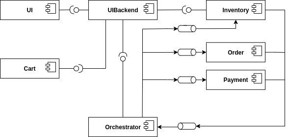

Architecture Overview
=====================

The t2 System consists of seven services. 

They realise the following business process:

.. toctree::
   :maxdepth: 1
   :caption: components:

   services/order
   services/payment
   services/inventory
   services/orchestrator
   services/uibackend
   services/cart
   services/creditinstitute

