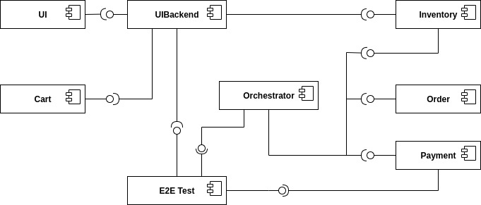

.. _usage:

Run on a Kubernetes Cluster
========================================

The preferred deployment for the T2 Store is on a Kubernetes cluster.

The T2 Store needs Kafka and a MongoDB. Install them any way you want to, e.g. from helm charts:

.. code-block:: php

    helm install mongo --set auth.enabled=false bitnami/mongodb
    helm install kafka bitnami/kafka

In case you want to name the deployed releases differently, you must adapt some environment variables in the T2 Store deployments. 
Confer the services' READMEs for more details.

For the T2 Store itself get the deployments and deploy them: 

.. code-block:: php

   git clone https://github.com/t2-project/kube.git
   cd kube
   kubectl create -f cdc/*
   kubectl create -f saga/*
   kubectl create -f notsaga/*

Look at the `kube repository <https://github.com/t2-project/kube>`__ for more details.

Run with Docker  
===============

You can run the T2 store as docker containers.

.. code-block:: php

   git clone https://github.com/t2-project/kube.git
   cd kube/docker
   docker-compose up -d

Build and Run Locally  
=====================

You can build and run the entire T2 Store locally.

The following guide describes how to this with the Order service as an example. 
You can build all other services (with minor exceptions) the same way.
You just need to replace 'order' with the respective service name.

Step 0 : Clone Repository
----------------------------------------------------

.. code-block:: php

   git clone https://github.com/t2-project/order.git

Step 1 : Versions and Environment Variables
----------------------------------------------------

The T2 Store is build with the following dependencies and tools. 
There is no guarantee that it works with others as well. 

======================= ==========================
Name                    Version
======================= ==========================
Maven                   :file:`3.6.3`
Spring Boot             :file:`2.4.4`
io.eventuate.tram.core  :file:`0.29.0.RELEASE`
io.eventuate.tram.sagas :file:`0.18.0.RELEASE`
jaeger                  :file:`3.2.0`
resilience4j            :file:`3.2.0`
Docker                  :file:`20.10.6`
======================= ==========================

The :file:`pom.xml` files read the versions from environment variables. 
That means you either have to manually export the versions into environment variables, or you source the `setenv.sh <https://github.com/t2-project/kube/blob/main/setenv.sh>`__ file.

.. code-block:: php

   wget https://raw.githubusercontent.com/t2-project/kube/main/setenv.sh
   . ./setenv.sh

Step 2 : Set Application properties
----------------------------------------

Set the `application properties <https://github.com/t2-project/order/tree/main/src/main/resources>`__.
They are in located at :file:`./src/main/resources/`
You want to consult the service's README on the meaning of the properties.

Step 3 : Build Local Dependencies
------------------------------------------

Most services of the T2 store depend on `common <https://github.com/t2-project/common>`__, thus you need to install that first:

.. code-block:: php

   git clone https://github.com/t2-project/common.git
   cd common/
   ./mvnw clean install

Step 2.1 : Exceptions for Service E2E Test
~~~~~~~~~~~~~~~~~~~~~~~~~~~~~~~~~~~~~~~~~~

The E2E Test also depends on the saga participants *inventory*, *payment* and *order*.

You must build and install them to your local maven repository as well.

.. code-block:: php

   git clone https://github.com/t2-project/payment.git
   cd payment/
   ./mvnw clean install
   ./mvnw install:install-file -Dfile=./target/payment-0.0.1-SNAPSHOT.jar.original -DpomFile=./pom.xml
   
.. code-block:: php

   git clone https://github.com/t2-project/inventory.git
   cd inventory/
   ./mvnw clean install
   ./mvnw install:install-file -Dfile=./target/inventory-0.0.1-SNAPSHOT.jar.original -DpomFile=./pom.xml

.. code-block:: php

   git clone https://github.com/t2-project/order.git
   cd order/
   ./mvnw clean install
   ./mvnw install:install-file -Dfile=./target/order-0.0.1-SNAPSHOT.jar.original -DpomFile=./pom.xml

Step 4 : Build and Run
----------------------

Now you can build and run the order service.

.. code-block:: php

   cd order/
   ./mvnw spring-boot:run

Or like this, in case you want to supply specific application properties (remember to use the path to *your* properties file).

.. code-block:: php

   cd order/
   ./mvnw clean install
   java -jar -Dspring.config.location=./src/main/resources/application.local.properties ./target/order-0.0.1-SNAPSHOT.jar

Step 5 : Build Docker Image
---------------------------

Each service repository contains a Dockerfile to build an image of that service.

Run with Test Service
=======================

The test service intercepts request from the UI Backend to the Orchestrator and also snatches the requests from the Payment Service to the Payment provider and answers them in the provider's stead. 
The setup is depicted below.
With this setup, the Test service knows the supposed outcome of all requests and can assert that the databases are in the correct state, after a saga instance finished.

For more Details, see the `Test Service's README <https://github.com/t2-project/e2e-tests>`__.

Step by Step 
------------

#. Run the E2E Test Service
#. Configure the UI Backend and the Payment Service 
#. Generate load
#. Look at the Logs 

Step 1 : Run E2E Test Service
-----------------------------

Run the `E2E Test Service <https://github.com/t2-project/e2e-tests>`__.
If you are on a kubernetes cluster, you may apply the deployment from the folder :file:`testsetup/` in the :file:`kube` repository.

.. code-block:: php

   kubectl apply -f testsetup/e2etest.yaml 

Step 2 : Configure the UI Backend and the Payment Service 
---------------------------------------------------------

Configure the UI Backend such that it sends confirmed orders to the Test service and configure the Payment service to send the payment requests to the Test service.

For Kubernetes
~~~~~~~~~~~~~~

In the UI Backend Deployment (:file:`uibackend.yml`):

.. code-block:: php

   - name: T2_ORCHESTRATOR_URL
     value: http://<e2e-test-host>/test/

In the Payment Deployment (:file:`payment.yml`):
   
.. code-block:: php

   - name: T2_PAYMENT_PROVIDER_DUMMY_URL
     value: http://<e2e-test-host>/fakepay

In both cases replace :file:`<e2e-test-host>` with the location of the Test Service.

Or use the deployment in the folder `testsetup <https://github.com/t2-project/kube/tree/main/testsetup>`__ because there the environment variables are already set as described above. 

Step 3 : Generate Load
-----------------------------

Confer the following section on how to generate load.
There must be some request or else there is nothing to test. 
The Test service does not generate load by itself.

Step 4 : Look at the Logs
-----------------------------

The Test results are printed to the logs. 
This might change but for now it is the easiest solution.

For Kubernetes
~~~~~~~~~~~~~~

.. code-block:: php

   kubectl logs <e2etest-pod>

Interpret Output
~~~~~~~~~~~~~~~~

A Test Report contains these Infomation:

*  **Expected Saga Status** : If it is :file:`FAILURE` then the saga instance supposed to have rolled back, other wise it should have run to completion.
*  **Saga Id** : Id of the Saga Instance in the Saga Instance DB. Used to look the Saga Instance up.
*  **Correlation Id** : Id used by the test service to correlate saga request to the Orchestrator with payment request from the Payment Service.
*  **Order**, **Inventory**, **Saga Instance** : Displays the test Result for the Order and Inventory service and the Saga Instance.

Report for Test that found every thing correct:

.. code-block:: php

   Test Report: 
       Expected Saga Status: FAILURE
       Saga Id: 000001796a7b7be5-7aef648a26a50000 Correlation Id: B42A90324D7639C1BCCC7A5E60080504
        Order: correct 
        Inventory: correct 
        Saga Instance: correct 

Report for Test that found that some entries in the inventory database were not deleted correctly:

.. code-block:: php

   Test Report: 
       Expected Saga Status: SUCCESS
       Saga Id: 000001796a7b7bde-7aef648a26a50000 Correlation Id: A79799BA296DF9035A11D1FF553D1AD2
        Order: correct 
        Inventory : reservations for sessionId A79799BA296DF9035A11D1FF553D1AD2 not deleted. ==> expected: <false> but was: <true>
        Saga Instance: correct 

Load Generation
===============

You can generate load manually by sending requests to the UIBackend (or using the UI, but it is ugly).
Confer the `UI Backend's README <https://github.com/t2-project/uibackend>`__ on how to talk to the UI Backend.

Or you can use a Load Generator to send request.
We recommend `Apache JMeter <https://jmeter.apache.org/>`__.

Apache JMeter
-------------

To run the T2 Store with the JMeter Load Generator, do the following :

#. Deploy the T2 Store
#. Make sure that the UI-Backend is accessible from outside the cluster - unless you want to put the load generator onto the cluster.
#. Install JMeter
#. Create or download a load profile
#. Run the load generator

Confer the previous sections on how to deploy the T2 Store.

Confer the `TeaStore Wiki <https://github.com/DescartesResearch/TeaStore/wiki/Testing-and-Benchmarking#22-jmeter>`__ on how to install and use JMeter.
Use the T2 Store load profiles instead of those from the TeaStore. 

You can find the T2 Store load profiles here : `<https://github.com/t2-project/kube/tree/main/loadprofiles>`__

The Load Profiles
~~~~~~~~~~~~~~~~~

Random Infinite Load Profile
""""""""""""""""""""""""""""

The profile :file:`t2-store-random_infinite.jmx` generates requests to the UI Backend as visualized below.
Beware to set :file:`-Jhostname` and :file:`-Jport` to your UI Backend's address and port. 

.. image:: ../arch/figs/load_generator.jpg

With this profile the generator adds between 1 to 5 products to the cart, and confirm the order afterwards.
It chooses the product at random from the products in the inventory.

Fixed Single Load Profile
"""""""""""""""""""""""""

The profile :file:`t2-store-fixed_single.jmx` is similar to the previous one, but, as visualized below, it places only one order over 3 random products.

.. image:: ../arch/figs/load_generator_single.jpg

Prometheus
==========

The T2 Store can be monitored with `Prometheus <https://prometheus.io/>`__

The T2 Store services use `Micrometer <https://micrometer.io/docs/registry/prometheus>`__ to expose metrics endpoints for prometheus. 
Check the endpoint :file:`/actuator/prometheus` to see which metrics are exposed.

Jaeger / Opentracing
====================

Most of the  T2 store's services include the dependencies to be traced with `Jaeger <https://www.jaegertracing.io/>`__.