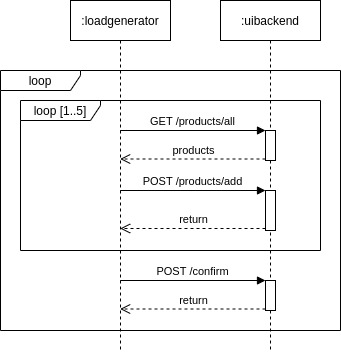

.. _use:

======================
Usage
======================

The T2-Project main point of usage is to trigger SLO violations with regard to response time and availability.
For that we need:

- :ref:`autoscaling`
- :ref:`monitoring`
- :ref:`trigger`
- :ref:`generate`

.. _autoscaling:

Influencing autoscaling behavior
================================

Assuming you set up the T2-Project on a platform that enables autoscaling (-> **Kubernetes**), you can use the *autoscaling management routes* to influence the autoscaling behavior of every service.
You can also use them otherwise, but what's the point of creating a *memory leak*/ *Denial of Service* if you don't use it?
These routes offer exactly that:
They are located under :file:`/autoscaling/` and offer functionality from disallowing all requests outside this directory (:file:`/autoscaling/(un)block-routes`) to setting a minimal percentage of memory to use at all times (:file:`/autoscaling/require-memory/{memory}`, :file:`/autoscaling/(clear|disable)-memory-leak`).
More information about these routes can be found in the swagger files (:file:`/swagger-ui.html`).

.. _monitoring:

Monitoring
==========

Instrumentation (Provided Metrics)
----------------------------------

The T2-Project's services are instrumented with `Micrometer <https://micrometer.io/>`__ for monitoring with `Prometheus <https://prometheus.io/>`__.

Each service, except the CDC service, which is provided by eventuate, expose prometheus metrics at the endpoint :file:`/actuator/prometheus>`.
Assuming you followed the instructions under :ref:`deploy` for either a deployment with kubernetes or docker-compose, and thus have the :file:`creditinstitute` service available at :file:`localhost:8087`, go to `<localhost:8087/actuator/prometheus>`__ to get the metrics of the credit institute service.
Change the port according to your deployment to see the metrics of the other services.

For the :file:`creditinstitute` service, the most interesting metrics are the :file:`http_server_requests_seconds` for the endpoint :file:`/pay`, because that is the API to be used by services that depend on the :file:`creditinstitute` service.

Prometheus set up
-----------------

Beware: the T2-Project is instrumented to provide metrics (as described in the previous section), but you must still set up the actual monitoring yourself.
This section describes how to set up prometheus along side the T2-Project kubernetes deployment described under :ref:`deploy`.
(If you are on docker, you are on you own.)

The following instructions rely on the helm charts from the prometheus community.

.. code-block:: sh

   # add repo for prometheus 
   helm repo add prometheus-community https://prometheus-community.github.io/helm-charts
   
   # get files to customize chart values
   wget https://raw.githubusercontent.com/t2-project/kube/main/prometheusfiles/prometheus-operator-values.yaml
   wget https://raw.githubusercontent.com/t2-project/kube/main/prometheusfiles/prometheus-blackbox-exporter-values.yaml

   # install charts
   helm install prometheus prometheus-community/kube-prometheus-stack -f ./prometheus-operator-values.yaml
   helm install blackbox-exporter prometheus-community/prometheus-blackbox-exporter -f ./prometheus-blackbox-exporter-values.yaml

.. _trigger:

Triggers
==========

Trigger Violation of an Availability SLO
----------------------------------------------------

Easiest way to violate an availability SLO is to kill the service. 

Kubernetes : 

.. code-block:: sh
   
   kubectl delete service creditinstitute-cs

Docker :

.. code-block:: sh

   docker container stop creditinstitute

Trigger Violation of a Response Time SLO
----------------------------------------------------

Make sure to generate some load, because without request there are no responses and without responses you cannot measure any response time.
Read section `generate`_ on how to generate load.

To manually change the response time, you can use the creditinstitute service.

Assuming you deployed the T2-Project as described in section :ref:`Deployment  <deploy>`, go to `<localhost:8087/swagger-ui.html>`__ to access the creditinstitute's API.
Use this API to increase or decrease the response time of the :file:`/pay` endpoint.

.. _generate:

Load Generation
===============

You can generate load manually accessing the UI or the UIBackend's Swagger-UI.

Or you can use a Load Generator to send request.
We recommend `Apache JMeter <https://jmeter.apache.org/>`__.

Apache JMeter
-------------

To run the T2-Project with the JMeter Load Generator, do the following :

#. Deploy the T2-Project
#. Get JMeter
#. Get a load profile and run the load generator

Deploy T2-Project
~~~~~~~~~~~~~~~

Deploy the Store as described in :ref:`Deployment  <deploy>` and make the UIBackend service accessible.

Get JMeter
~~~~~~~~~~~~~~~

Download Apache JMeter, e.g. from their `website <https://jmeter.apache.org/download_jmeter.cgi>`__. 

.. code-block:: sh

   wget https://dlcdn.apache.org//jmeter/binaries/apache-jmeter-<version-of-your-choice>.tgz 
   tar xvf apache-jmeter-<version-of-your-choice>.tgz

Get Load Profiles and run Generator
~~~~~~~~~~~~~~~~~~~~~~~~~~~~~~~~~~~

Download the `JMeter <https://jmeter.apache.org/download_jmeter.cgi>`__ load profiles for the T2-Project and run the generator.

There are two predefined loadprofiles:

.. code-block:: sh

   loadProfile=t2-project-fixed-single.jmx 

which generates load for placing exactly three orders per user and

.. code-block:: sh

   loadProfile=t2-project-random-infinite.jmx 

| which runs indefinitely.
| Once you have chosen which profile to use, you can run them by calling

.. code-block:: sh

   wget https://raw.githubusercontent.com/t2-project/kube/main/loadprofiles/$loadProfile
   java -jar ./apache-jmeter-$JMETER_VERSION/bin/ApacheJMeter.jar -t ./$loadProfile -n $ARGUMENTS

Both loadprofiles take the following arguments:

==================== ======================================================================================================================================= ========== ======================================
 Argument             Description                                                                                                                             Required              Default Value
==================== ======================================================================================================================================= ========== ======================================
 -Jhostname           Address of the UI Backend                                                                                                                true           "" (localhost for local testing)
 -JnumUser            Number of users to test with                                                                                                             true           "" 
 -Jport               Port of the UI Backend                                                                                                                   true           "" (8081 for local testing) 
 -JrampUp             Timeout (in seconds) until every user must have been started - one user will be started after every ($numUser/ $rampUp) second(s)        true           "" 
 -JthinkTimeTimeout   minimal amount of time (in millisceonds) a user needs to choose a product                                                                false      30000 (30s)
 -JthinkTimeRange     Maximum possible value of the normal distribution deciding when the user chooses a product (in millisceonds) once the timeout is over    false      30000 (30s)
 -l                   Logfile to write test results into                                                                                                       false          "" (logfile.log recommended)
 -n                   Start JMeter in CLI Mode                                                                                                                 true           <no argument>
==================== ======================================================================================================================================= ========== ======================================

For more details on what the profiles do, read the next two sections.

Fixed Single Load Profile
"""""""""""""""""""""""""

The profile :file:`t2-project-fixed-single.jmx` is similar to the previous one, but, as visualized below, it places only one order over 3 random products.

.. image:: ../arch/figs/load_generator_single.jpg

Random Infinite Load Profile
""""""""""""""""""""""""""""

The profile :file:`t2-project-random-infinite.jmx` generates requests to the UI Backend as visualized below.

With this profile the generator adds between 1 to 5 products to the cart, and confirm the order afterwards.
It chooses the product at random from the products in the inventory.
