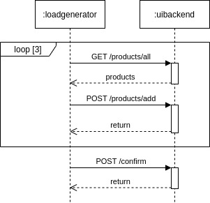

.. _use:

======================
Usage
======================

The T2 Store main point of usage is to trigger SLO violations with regard to response time and availability.
For that we need:

- :ref:`monitoring`
- :ref:`trigger`
- :ref:`generate` 

.. _monitoring:

Monitoring
==========

Instrumentation (Provided Metrics)
----------------------------------

The T2 Store's services are instrumented with `Micrometer <https://micrometer.io/>`__ for monitoring with `Prometheus <https://prometheus.io/>`__. 

Each service, except the CDC service, which is provided by eventuate, expose prometheus metrics at the endpoint :file:`/actuator/prometheus>`.
Assuming you followed the instructions under :ref:`deploy` for either a deployment with kubernetes or docker-compose, and thus have the :file:`creditinstitute` service available at :file:`localhost:8087`, go to `<localhost:8087/actuator/prometheus>`__ to get the metrics of the credit institute service.
Change the port according to your deployment to see the metrics of the other services.

For the :file:`creditinstitute` service, the most interesting metrics are the :file:`http_server_requests_seconds` for the endpoint :file:`/pay`, because that is the API to be used by services that depend on the :file:`creditinstitute` service.

Prometheus set up
-----------------

Beware: the T2 Store is instrumented to provide metrics (as described in the previous section), but you must still set up the actual monitoring yourself.
This section describes how to set up prometheus along side the T2 store kubernetes deployment described under :ref:`deploy`.
(If you are on docker, you are on you own.)

The following instructions rely on the helm charts from the prometheus community.

.. code-block:: php

   # add repo for prometheus 
   helm repo add prometheus-community https://prometheus-community.github.io/helm-charts
   
   # get files to customize chart values
   wget https://raw.githubusercontent.com/t2-project/kube/main/prometheusfiles/prometheus-operator-values.yaml
   wget https://raw.githubusercontent.com/t2-project/kube/main/prometheusfiles/prometheus-blackbox-exporter-values.yaml

   # install charts
   helm install prometheus prometheus-community/kube-prometheus-stack -f ./prometheus-operator-values.yaml
   helm install blackbox-exporter prometheus-community/prometheus-blackbox-exporter -f ./prometheus-blackbox-exporter-values.yaml

.. _trigger:

Triggers
==========

Trigger Violation of an Availability SLO
----------------------------------------------------

Easiest way to violate an availability SLO is to kill the service. 

Kubernetes : 

.. code-block:: php
   
   kubectl delete service creditinstitute-cs

Docker :

.. code-block:: php  

   docker container stop creditinstitute

Trigger Violation of a Response Time SLO
----------------------------------------------------

Make sure to generate some load, because without request there are no responses and without responses you cannot measure any response time.
Read section `generate`_ on how to generate load.

To manually change the response time, you can use the creditinstitute service.

Assuming you deployed the T2 Store as described in section :ref:`Deployment  <deploy>`, go to `<localhost:8087/swagger-ui.html>`__ to access the creditinstitute's API.
Use this API to increase or decrease the response time of the :file:`/pay` endpoint.

.. _generate:

Load Generation
===============

You can generate load manually accessing the UI or the UIBackend's Swagger-UI.

Or you can use a Load Generator to send request.
We recommend `Apache JMeter <https://jmeter.apache.org/>`__.

Apache JMeter
-------------

To run the T2 Store with the JMeter Load Generator, do the following :

#. Deploy the T2 Store
#. Get JMeter
#. Get a load profile and run the load generator

Deploy T2 Store
~~~~~~~~~~~~~~~

Deploy the Store as described in :ref:`Deployment  <deploy>` and make the UIBackend service accessible.

Get JMeter
~~~~~~~~~~~~~~~

Download Apache JMeter, e.g. from their `website <https://jmeter.apache.org/download_jmeter.cgi>`__. 

.. code-block:: php

   wget https://dlcdn.apache.org//jmeter/binaries/apache-jmeter-<version-of-your-choice>.tgz 
   tar xvf apache-jmeter-<version-of-your-choice>.tgz

Get Load Profiles and run Generator
~~~~~~~~~~~~~~~~~~~~~~~~~~~~~~~~~~~

Download the load profiles for the T2 Store from `here <https://jmeter.apache.org/download_jmeter.cgi>`__ and run the generator.

.. code-block:: php

   wget https://raw.githubusercontent.com/t2-project/kube/main/loadprofiles/t2-store-fixed-single.jmx 
   java -jar ./apache-jmeter-5.4.1/bin/ApacheJMeter.jar -t ./t2-store-fixed-single.jmx -Jhostname localhost -Jport 8081 -JnumUser 1 -JrampUp 1 -l logfile.log -n

This profiles generates load for placing three order and then stops.

You can also use another profile that runs infinitely:

.. code-block:: php

   wget https://raw.githubusercontent.com/t2-project/kube/main/loadprofiles/t2-store-random-infinite.jmx 
   java -jar ./apache-jmeter-5.4.1/bin/ApacheJMeter.jar -t ./t2-store-random-infinite.jmx -Jhostname localhost -Jport 8081 -JnumUser 1 -JrampUp 1 -l logfile.log -n

For more details on what the profiles do, read the next two sections.

Fixed Single Load Profile
"""""""""""""""""""""""""

The profile :file:`t2-store-fixed-single.jmx` is similar to the previous one, but, as visualized below, it places only one order over 3 random products.

Random Infinite Load Profile
""""""""""""""""""""""""""""

The profile :file:`t2-store-random-infinite.jmx` generates requests to the UI Backend as visualized below.
Beware to set :file:`-Jhostname` and :file:`-Jport` to your UI Backend's address and port. 

.. image:: ../arch/figs/load_generator.jpg

With this profile the generator adds between 1 to 5 products to the cart, and confirm the order afterwards.
It chooses the product at random from the products in the inventory.