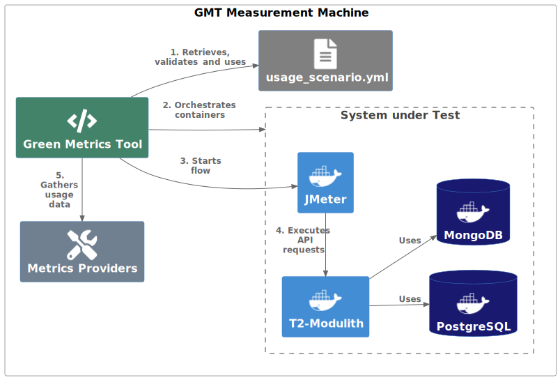

==================
Green Metrics Tool
==================

We are using the `Green Metrics Tool <https://docs.green-coding.io/>`__ (GMT) from Green Coding Solutions for executing energy tests with different usage scenarios.

The ``usage_scenario.yml`` files are located in the directory ``energy-tests`` in the GitHub repo `DevOps <https://github.com/t2-project/devops/tree/main/energy-tests/gmt>`__. You can find the documentation about the format ``usage_scenario.yml`` `here <https://docs.green-coding.io/docs/measuring/usage-scenario/>`__.

All the usage scenarios provided use :doc:`JMeter <jmeter>` for the execution of requests to the T2-Project backend:

* T2-Microservices: `UI Backend Service <https://github.com/t2-project/uibackend>`__ → ``uibackend:8080``
* T2-Modulith: `Modulith <https://github.com/t2-project/modulith>`__ → ``backend:8080``

Setup
=====

The following shows the measurement setup with the Green Metrics Tool on one of the measurement machines provided by Green Coding Solutions, which measures a usage scenario from the T2-Modulith.

The actual measurement is executed by Python scripts that are part of the Green Metrics Tol. If a new measurement job is executed, first the ``usage_scenario.yml`` gets downloaded, processed and validated. Afterwards the measurement environment is prepared accordingly and the Docker containers for the system to be measured are started. Finally, the measurement run is started using the flow provided, meaning JMeter executes its test plan. During that time the Green Metrics Tool gathers usage data from various metrics providers and saves them into the database at the end.

Usage
=====

In this section the usage of the Green Metrics Tool is described, locally and with the measurement cluster provided by Green Coding Solutions.

Local testing
-------------

See the `official documentation <https://docs.green-coding.io>`__ on how to install and run the Green Metrics Tool on your local system.

The following examples are only meant to check if the usage scenarios are executed without any error. To execute real measurements, see the section :ref:`measurement_on_cluster` below.

Execute a measurement run with a local ``usage_scenario.yml``:

.. code-block:: bash

    python3 runner.py --uri ~/t2-project/devops \ 
     --filename "energy-tests/gmt/monolith-usage_scenario-minimal-base.yml" \ 
     --name "T2-Modulith (Minimal Scenario with JMeter)" \ 
     --skip-system-checks --dev-no-build --dev-no-metrics --dev-no-sleeps \ 
     --print-logs

Execute a measurement run with a remote ``usage_scenario.yml``:

.. code-block:: bash

   python3 runner.py --uri https://github.com/t2-project/devops \ 
   --filename "energy-tests/gmt/monolith-usage_scenario-minimal-base.yml" \ 
   --name "T2-Modulith (Minimal Scenario with JMeter)" \ 
   --skip-system-checks --dev-no-build --dev-no-metrics --dev-no-sleeps \ 
   --print-logs

The parameters ``--skip-system-checks``, ``--dev-no-build``, ``--dev-no-metrics``, ``--dev-no-sleeps`` and ``--print-logs`` are all optional. The first four are used to speed up the execution of usage scenarios during development and testing.
Depending on the usage scenario you may need to remove the parameter ``--dev-no-sleeps``. It skips all sleeps that may be required to execute a usage scenario e.g. to wait for all services to be ready.

.. _measurement_on_cluster:

Measurement Cluster
-------------------

To measure a software on the `measurement cluster provided by Green Coding Solutions <https://docs.green-coding.io/docs/measuring/measurement-cluster/>`__ you can submit it via the form on `https://metrics.green-coding.io/request.html <https://metrics.green-coding.io/request.html>`__.

Example form inputs:

* Name: T2-Modulith (Minimal Scenario with JMeter)
* URL: ``https://github.com/t2-project/devops``
* Filename: ``energy-tests/gmt/monolith-usage_scenario-minimal-base.yml``
* Branch: ``main``
* Hardware: Fujitsu Esprimo P956
* Measurement: One-Off [Free - Fair use]

All executed measurements can be found on the GMT page `Repository overview <https://metrics.green-coding.io/repositories.html>`__ under the repository ``/t2-project/devops``. There you also have the possibility to compare multiple measurements on your own:

* Open the repository ``/t2-project/devops``
* Select the measurements you want to compare
* Click the button "Compare: x Run(s)" on the top of the page

Some measurements are discussed in the following section `gmt-learnings` and on the page :ref:`measurement-results`.

.. _gmt-learnings:

Required Adjustments
====================

A few adjustments had to be made to the T2-Project, the JMeter container image used and the Green Metrics Tool in order to be able to carry out measurements successfully. The necessary adjustments to the T2-Project and the JMeter container image are briefly described in this section.

Adjustments to the T2-Project
-----------------------------

The T2-Project uses a fake service as a credit institute for payments. Due to the original orientation of the T2-Project, the `CreditInstitute service <https://github.com/t2-project/creditinstitute/>`__ is designed to randomly provoke SLO violations. This is not acceptable for reproducible energy measurements. Furthermore, there is no added value in
including this service in the energy measurement. The decision was therefore made to omit the service completely and to make the call to the CreditInstitute service optional via configuration in the payment service. This means that no CreditInstitute service is required for measurements with GMT and the payment service (T2-Microservices) or the payment module (T2-Modulith) returns an ok directly without requesting the CreditInstitute service.

For the deployment of the T2-Microservices system, a change had to be made to the container image for the PostgreSQL databases, which is provided by Eventuate. The image cannot be executed automatically in the interactive mode of Docker (parameter ``-it``), as is done by GMT. A corresponding `pull request <https://github.com/eventuate-foundation/eventuate-common/pull/135>`__ was created, but not merged in the period of this thesis. For this reason, a `self-created container image <https://hub.docker.com/r/t2project/eventuate-tram-sagas-postgres>`__ is used, which contains the required change.

The Orchestrator microservice has been extended with an optional logging mechanism (see `commit 383febd <https://github.com/t2-project/orchestrator/commit/383febd>`__) to be able to log the end of the asynchronous saga process with the message ``GMT_SCI_R=1`` and the corresponding timestamp. This is relevant so that GMT can calculate the SCI score correctly, taking into account not only the synchronous part of the order process, but also the asynchronous part.

Adjustments to the JMeter Container Image
-----------------------------------------

For JMeter, the container image `justb4/jmeter <https://hub.docker.com/r/t2project/jmeter>`__ is used, which is the most downloaded image for JMeter at DockerHub. It is designed so that JMeter is started using docker run and the container terminates as soon as JMeter has finished executing a test plan. This is unsuitable for the use with GMT. A container must always be running in a GMT setup and must be able to execute commands at runtime using docker exec. This requires the entry point of the container image to be adapted accordingly so that JMeter is not started immediately when the container is started. The customized version can be found in the GitHub repository `t2-project/docker-jmeter <https://github.com/t2-project/docker-jmeter>`__ and at DockerHub under the name `t2project/jmeter <https://hub.docker.com/r/t2project/jmeter>`__.

Learnings
=========

While testing and executing various usage scenarios with the Green Metrics Tool, many lessons were learned about what needs to be considered. These learnings are documented here.

.. contents:: Overview Learnings
   :depth: 1
   :local:

1. Idle energy consumption
--------------------------

With GMT the absolute energy consumption value is not really important, because this value depends on many variables, especially the machine and environment. Therefore, the results are usually only relevant for relative comparisons between different runs. It's important that the energy consumption of the machine in idle mode (baseline) is the same between runs, so it doesn't influence the results. The team behind the GMT ensures this by executing a measurement that should always give the same result regularly: `Measurement Control Workload <https://metrics.green-coding.io/timeline.html?uri=https://github.com/green-coding-berlin/measurement-control-workload&filename=usage_scenario.yml&branch=event-bound&machine_id=7>`__.

2. Request-Consumption Proportionality
--------------------------------------

The energy consumption is *not* proportional to the number of requests.
See the data of measurements with different number of executions.

.. collapse:: Measurements with different number of executions

    **Scenario:** One user executes multiple orders one after another.

    .. list-table::
      :header-rows: 1
      :stub-columns: 1

      * - Number of Executions
        - Duration [s]
        - Machine Energy [J]
        - CPU Energy [J]
        - Memory Energy [J]
        - Network Energy [J]
        - SCI [mgCO2e/order]
      * - `0 <https://metrics.green-coding.io/stats.html?id=f1e0171c-a5f6-4f24-b5e4-558fe334993c>`__
        - 3.81
        - 113.25
        - 53.19
        - 3.00
        - 0.00
        - N/A
      * - `1 <https://metrics.green-coding.io/stats.html?id=25614e23-d474-4953-a08b-3808f8e46fe6>`__
        - 5.82
        - 181.52
        - 85.83
        - 5.40
        - 1.02
        - 34.2
      * - `2 <https://metrics.green-coding.io/stats.html?id=a75a499b-b066-440c-ba0d-9ac8c552baa4>`__
        - 5.98
        - 184.07
        - 87.43
        - 5.46
        - 1.93
        - 17.4
      * - `100 <https://metrics.green-coding.io/stats.html?id=7e40ee3b-733e-4b66-aaba-e1e32a412a28>`__
        - 13.40
        - 393.86
        - 166.47
        - 13.51
        - 83.08
        - 0.8
    
    **Findings:**
    
    * calculations:
       - required energy for the second execution (based on the difference between 1 and 2 executions):
          + Duration: 0.16 s
          + Machine Energy: 2.55 J
          + CPU Energy 1.6 J
          + Memory Energy: 0.04 J
          + Network Energy: 0.91 J
       - average required energy for one execution in the scenario with 100 executions (consumption of 0 executions is subtracted):
          + Duration: 0.1 s
          + Machine Energy: 2.81 J
          + CPU Energy 1.13 J
          + Memory Energy: 0.11 J
          + Network Energy: 0.83 J
    * CPU energy consumption decreases with more executions

3. Energy overhead by JMeter
----------------------------

At the moment (as of April 2024) GMT can only measure the energy consumption of the whole system that is part of an usage scenario. Therefore, the energy consumption of JMeter is always included in the resulting energy values. However, there is the promise that GMT will offer the support for separating two logical and physical disjunct components onto two machines in the future.

The measurement of individual components is not possible with GMT, because there is no clear way of how to isolate individual components and GMT has the philosophy that a usage scenario should contain all components to reflect an actual use case of the software. Therefore, all components that are part of an usage scenario are also part of the energy measurement. See the section `Granularity of energy data <https://docs.green-coding.io/docs/prologue/philosophy-methodology/#granularity-of-energy-data>`__ in the docs of the GMT for more information.

For comparisons between different applications this should not be a problem, as long as the respective components behave the same. In theory, that should also be the case with JMeter that always executes the same test plan (perhaps with different parameters, so that have to be kept in mind for comparisons).
However, measurements with the GMT setup have shown that the start process of JMeter can take different lengths of time (3--10~seconds), so that this can have a negative effect on the results. This must be taken into account when comparing measurement results.

.. collapse:: Measurement of JMeter Overhead

    **Scenario:** JMeter starts with the usual test plan, but no requests are made

    .. list-table::
      :header-rows: 1
      :stub-columns: 1

      * - Number of executions
        - Duration [s]
        - CPU Usage Mean of ``jmeter`` [%]
        - CPU Usage Max of ``jmeter`` [%]
        - Machine Energy [J]
        - CPU Energy [J]
        - Memory Energy [J]
        - Network Energy [J]
      * - `0 <https://metrics.green-coding.io/stats.html?id=f1e0171c-a5f6-4f24-b5e4-558fe334993c>`__
        - 3.81
        - 39.54
        - 82.12
        - 113.25
        - 53.19
        - 3.00
        - 0.00

    **Findings:**

    * JMeter itself already consumes a lot of energy when it starts executing a test plan, even when no requests are made. However, this only effects the beginning of the phase and should not influence the behavior of the backend later on. Also, because we use JMeter in all measurements with the same test plan, comparisons should not be a problem.
    * Machine components other than CPU and memory also consume a significant amount of energy. In the scenario circa 60 J.

4. Network energy estimation
----------------------------

The metric *Network Transmission Energy* that is part of the measurement results shown in the GMT frontend refers to the estimated energy consumption by network traffic in a distributed global system. The value is calculated by the total amount of sent and received bytes from the network interface multiplied by a constant value. The constant used is the one calculated by Aslan et al. down to 2024, i.e. 0.002652 kWh/GB at the time of writing this.

It is therefore important to note that the value is not the energy consumption of network communication within a machine or data center, but the potential energy consumption that arises when the system is operated in a globally distributed way. This is not the case for a typical microservices system, which is operated in a data center or in several data centers in the same region. The `Cloud Carbon Footprint Tool <https://www.cloudcarbonfootprint.org/docs/methodology/>`__ does not include such network communication within a data center at all. Furthermore, it is generally questionable how useful it is to estimate the energy consumption of network communication using a constant for GB/kWh. Arne Tarara from Green Coding Solutions decided to use this methodology "as it bests incentives the user to keep the network traffic to a minimum" (source: `https://www.green-coding.io/co2-formulas/ <https://www.green-coding.io/co2-formulas/>`__).

See the GMT documentation of the metric provider `Network IO - cgroup - container <https://docs.green-coding.io/docs/measuring/metric-providers/network-io-cgroup-container/>`__ and the article `CO2 formulas <https://www.green-coding.io/co2-formulas/>`__ for more information.

5. Measure asynchronous operations
----------------------------------

The runtime phase in GMT is based on the defined `flow <https://docs.green-coding.io/docs/measuring/usage-scenario/#flow>`_: it starts with the execution of a command and ends when the command is finished.
If the command triggers an asynchronous operation the flow/phase may end before the asynchronous operation actually has finished.

So the question arises as to how the entire operation can be recorded and measured?

Currently I'm aware of two options to measure a whole asynchronous operation:

* Add a sleep command to your flow to extend the duration of the flow long enough
   - Challenge: How long should the sleep be?
* Check in a loop if the asynchronous operation has finished
   - Only possible if the operation changes some data that can be checked
   - Problem: Check increases the overall footprint, so it may make comparisons between synchronous and asynchronous systems unfair

The *confirm order* operation (``POST http://backend/confirm``) of the T2-Project in the monolithic implementation is synchronous, but in the microservices implementation it is asynchronous. There the order confirmation is implemented with the saga pattern, so the operation is only considered finished as soon as the *orchestrator* received a success message from all services participating in the saga (*payment*, *order* and *inventory*) via the message broker Kafka.

To make it visible in the graphs of a measurement results page, when the order is finished, a `note with a timestamp can be written to stdout <https://docs.green-coding.io/docs/measuring/usage-scenario/#read-notes-stdout-format-specification>`_ (in this case by the *orchestrator* service).

6. Using think time or not
--------------------------

During testing of usage scenarios I used many different parameters configuring the test plan execution. One of them is think time between requests.

When does it make sense to use a think time in measurements?

   * most importantly: use always the same thinking times to make comparisons possible
   * if you want to have a load test scenario, don't use a think time
   * if you want to have a real world usage scenario, use a realistic think time
   * one additional sec think time increases the machine energy consumption in a one user scenario by ~13-15 J and the cpu energy consumption by 4-5 J (idle consumption per second)
   * in the most test cases you shouldn't use a think time

    .. collapse:: Measurement of Think Time

        **Scenario:** One user executes one order with different think times.

        .. list-table::
          :header-rows: 1
          :stub-columns: 1

          * - Think Time
            - Duration [s]
            - Machine Energy [J]
            - CPU Energy [J]
            - Memory Energy [J]
            - Network Energy [J]
            - SCI [mgCO2e/order]
          * - `0 <https://metrics.green-coding.io/stats.html?id=25614e23-d474-4953-a08b-3808f8e46fe6>`__
            - 5.82
            - 181.52
            - 85.83
            - 5.40
            - 1.02
            - 34.2
          * - `1 <https://metrics.green-coding.io/stats.html?id=3849a50a-05ad-4345-9172-abf402ef5810>`__
            - 6.81
            - 195.18
            - 84.93
            - 5.71
            - 1.03
            - 37.7
          * - `2 <https://metrics.green-coding.io/stats.html?id=1b760419-456b-489d-b462-7d0201894a3c>`__
            - 7.83
            - 214.53
            - 90.22
            - 6.42
            - 1.03
            - 42.1
          * - `10 <https://metrics.green-coding.io/stats.html?id=6fd10682-c40b-4f48-a1a6-77bb80ecf7cd>`__
            - 15.66
            - 319.88
            - 94.31
            - 9.77
            - 1.06
            - 69.7

        Differences Machine Energy to base (0 sec):

        .. list-table::
          :header-rows: 1
          :align: left

          * - 1 sec
            - 2 sec
            - 10 sec
          * - +13.66 J (+7.5 %)
            - +33.01 J (+18.2 %)
            - +138.36 J (+76.2 %)

        Differences CPU Energy to base (0 sec):

        .. list-table::
          :header-rows: 1
          :align: left

          * - 1 sec
            - 2 sec
            - 10 sec
          * - -0,9 J (-1 %)
            - +4.4 J (+5,1 %)
            - +8.5 J (+9,9 %)

7. Warm-up of application
-------------------------

Applications with a runtime environment and a JIT compiler optimize themselves during runtime. This is the case with the HotSpot JVM used by the T2-Project services. Therefore, in performance benchmarking, it is common practice ignore the first measurements during *warm-up* and only consider the measurement results when the application is considered to be *warm*.

The question arises as to how this should be handled in energy measurements. Arne Tarara (Green Coding Solutions) is convinced that the warm-up phase must also be included in the energy measurement. Arne argues that these are operations that must be performed at a certain point in time to bring the application to its operating point, thus consuming energy and causing carbon emissions. See `discussion with Arne Tarara <https://github.com/green-coding-solutions/green-metrics-tool/discussions/595>`_ for insights.

However, for a better understanding of the results, it seems useful to have measurement results for the warm-up phase as well as for the actual execution of a scenario and not to mix them together. GMT does not support an explicit warm-up phase. However, due to the flexibility in the definition of a usage scenario, an additional step can easily be defined in the flow part in ``usage_scenario.yml``, which can be used as a warm-up.

**Numbers:**

See the measurements of multiple flows below to see the difference between a *cold* application and a *warm* application. To get measurement data for multiple executions, multiple flows within a usage scenario were used.
| In the scenario with 1 user, the average CPU utilization of the ``backend`` component of the first flow (29.38 %) and the second flow (23.90 %) with 100 executions each is much higher than the subsequent flows (<14 %). After the 10. flow the average CPU utilization stays under 10 %.
| In the scenario with 100 users, only the first flow required a lot of time (reason unknown) and therefore also a lot more energy. All the other results were quite similar with a little increase in performance and a little decrease in energy consumption.

.. collapse:: Measurement of multiple flows (1 user)

    **Scenario:** `25 flows á 100 executions <https://metrics.green-coding.io/stats.html?id=b5478c99-c8b4-4f65-a25b-99180f5ced2f>`__

    .. list-table::
      :header-rows: 1
      :stub-columns: 1

      * - Flow
        - Duration [s]
        - Machine Power [W]
        - Machine Energy [J]
        - Network Energy [J]
        - ``backend`` CPU Utilization Mean [%]
      * - All
        - 226.04
        - 24.28
        - 5488.78
        - 2079.65
        - 10.33
      * - 1.
        - 12.10
        - 26.93
        - 325.9
        - 83.52
        - 29.38
      * - 2.
        - 8.94
        - 27.96
        - 249.82
        - 83.14
        - 23.90
      * - 3.
        - 9.32
        - 24.82
        - 231.35
        - 83.12
        - 13.57
      * - 4.
        - 8.85
        - 24.54
        - 217.22
        - 83.12
        - 11.43
      * - 5.
        - 8.55
        - 25.52
        - 218.25
        - 83.12
        - 13.22
      * - 6.
        - 8.92
        - 24.00
        - 214.04
        - 83.15
        - 9.95
      * - 7.
        - 8.55
        - 25.10
        -  214.54
        - 83.14
        - 10.69
      * - 8.
        - 8.80
        - 24.28
        - 213.72
        - 83.15
        - 9.85
      * - ...
        - 
        - 
        - 
        - 
        - 
      * - 16.
        - 9.30
        - 23.24
        - 216.14
        - 83.15
        - 5.76
      * - 17.
        - 8.90
        - 25.48
        - 208.98
        - 83.13
        - 6.85
      * - 18.
        - 8.69
        - 24.45
        - 212.39
        - 83.16
        - 9.57
      * - 19.
        - 8.75
        - 24.06
        - 210.50
        - 83.17
        - 7.81
      * - 20.
        - 8.95
        - 23.54
        - 210.67
        - 83.13
        - 6.71
      * - 21.
        - 9.04
        - 22.98
        - 207.64
        - 83.16
        - 4.99
      * - 22.
        - 9.01
        - 23.00
        - 207.34
        - 83.17
        - 6.53
      * - 23.
        - 8.97
        - 23.62
        - 211.96
        - 83.15
        - 6.50
      * - 24.
        - 9.02
        - 23.65
        - 213.38
        - 83.16
        - 7.29
      * - 25.
        - 8.82
        - 23.46
        - 206.83
        - 83.16
        - 7.37

.. collapse:: Measurement of multiple flows (100 parallel users)

    **Scenario:** `10 flows á 100 users <https://metrics.green-coding.io/stats.html?id=fc9d3906-c0fa-4327-85d6-eac12b4a72ed>`__

    .. list-table::
      :header-rows: 1
      :stub-columns: 1

      * - Flow
        - Duration [s]
        - Machine Power [W]
        - Machine Energy [J]
        - Network Energy [J]
        - ``backend`` CPU Utilization Mean [%]
      * - All
        - 79.11
        - 28.48
        - 2253.41
        - 951.19
        - 19.79
      * - 1.
        - 27.36
        - 23.28
        - 637.00
        - 130.40
        - 18.22
      * - 2.
        - 6.03
        - 30.46
        - 183.77
        - 95.65
        - 22.15
      * - 3.
        - 6.02
        - 32.00
        - 192.67
        - 94.39
        - 20.26
      * - 4.
        - 5.76
        - 31.15
        - 179.58
        - 92.58
        - 21.17
      * - ...
        - 
        - 
        - 
        - 
        - 
      * - 9.
        - 5.64
        - 31.16
        - 175.69
        - 89.25
        - 19.43
      * - 10.
        - 5.57
        - 30.30
        - 168.87
        - 88.02
        - 17.71

8. Impact of logging
--------------------

Logging of all requests by JMeter requires a significant amount of energy (in a test scenario +13%). Therefore, it should be enabled only if really necessary, e.g. during testing of new usage scenarios. The GMT documentation page `Best practices <https://docs.green-coding.io/docs/measuring/best-practices/#13-turn-logging-off>`_ also recommends to turn logging off to avoid overhead.

.. collapse:: Measurement impact of logging

    **Measurement Scenario:** One user executes 100 orders one after another.

    .. list-table::
      :header-rows: 1
      :stub-columns: 1

      * - Logging
        - Duration [s]
        - Machine Energy [J]
        - CPU Energy [J]
        - Memory Energy [J]
        - Network Energy [J]
      * - `on <https://metrics.green-coding.io/stats.html?id=7e40ee3b-733e-4b66-aaba-e1e32a412a28>`__
        - 13.40
        - 393.86
        - 166.47
        - 13.51
        - 83.08
      * - `off <https://metrics.green-coding.io/stats.html?id=940a3183-0724-46c4-89ab-d52923dbe98f>`__
        - 11.93
        - 346.74
        - 144.05
        - 12.20
        - 83.06

9. High Load and Scaling
------------------------

The original idea of the GMT is to execute standard usage scenarios and measure the energy consumption of such. Therefore, GMT is not designed for load testing or similar approaches. However, due to the flexible way in which usage scenarios can be defined, it is easily possible to generate larger loads and measure energy consumption. However, it must be taken into account that GMT cannot be used to create dynamic scaling scenarios. When a measurement is started, exactly one container instance is started for each service and no horizontal scaling is possible at runtime.

.. collapse:: Measurements in load test scenarios

    **Scenario:** Many users in parallel: Each user checks out the inventory, think for 30-60 sec, add a random product to cart (3 times) and finally confirms the order. Logging of JMeter requests is disabled.

    **Duration & Pre-Configured Ramp-up Times:**

    .. list-table::
      :header-rows: 1
      :stub-columns: 1
      :align: left

      * - Number of Users
        - Duration [s]
        - Ramp-up time [s]
      * - `100 <https://metrics.green-coding.io/stats.html?id=9c29b4e9-7ee5-416e-9be5-6d183f14e3fc>`__
        - 186.26
        - 2
      * - `200 <https://metrics.green-coding.io/stats.html?id=eb85a781-4e7b-4570-a7bb-b9cd98ab7ebb>`__
        - 181.97
        - 2
      * - `300 <https://metrics.green-coding.io/stats.html?id=2737a2e8-677c-43c0-a167-57f7e9495160>`__
        - 175.22
        - 5
      * - `400 <https://metrics.green-coding.io/stats.html?id=1797131a-8bf2-44af-a845-f5fc462e6de0>`__
        - 180.08
        - 5
      * - `500 <https://metrics.green-coding.io/stats.html?id=d213415f-584c-407e-ab3b-ebc7c911df30>`__
        - 182.32
        - 5

    **Energy Consumption:**

    .. list-table::
      :header-rows: 1
      :stub-columns: 1
      :align: left

      * - Number of Users
        - Machine Power [W]
        - Machine Energy [J]
        - CPU Energy [J]
        - Memory Energy [J]
        - Network Energy [J]
      * - `100 <https://metrics.green-coding.io/stats.html?id=9c29b4e9-7ee5-416e-9be5-6d183f14e3fc>`__
        - 15.83
        - 2949.27
        - 370.25
        - 94.94
        - 311.21
      * - `200 <https://metrics.green-coding.io/stats.html?id=eb85a781-4e7b-4570-a7bb-b9cd98ab7ebb>`__
        - 16.42
        - 2990.24
        - 449.09
        - 99.10
        - 844.34
      * - `300 <https://metrics.green-coding.io/stats.html?id=2737a2e8-677c-43c0-a167-57f7e9495160>`__
        - 17.18
        - 3009.78
        - 513.25
        - 100.76
        - 1608.60
      * - `400 <https://metrics.green-coding.io/stats.html?id=1797131a-8bf2-44af-a845-f5fc462e6de0>`__
        - 17.66
        - 3180.31
        - 610.23
        - 108.03
        - 2588.05
      * - `500 <https://metrics.green-coding.io/stats.html?id=d213415f-584c-407e-ab3b-ebc7c911df30>`__
        - 18.43
        - 3360.63
        - 687.72
        - 113.05
        - 3781.67

    Differences Machine Power:

    .. list-table::
      :header-rows: 1
      :align: left

      * - 100→200
        - 200→300
        - 300→400
        - 400→500
      * - +0.59 W
        - +0,76 W
        - +0,48 W
        - +0,77 W

    Differences Machine Energy:

    .. list-table::
      :header-rows: 1
      :align: left

      * - 100→200
        - 200→300
        - 300→400
        - 400→500
      * - +40.97 J
        - +19.54 J
        - +170,53 J
        - +180,32 J

    Differences CPU Energy:

    .. list-table::
      :header-rows: 1
      :align: left

      * - 100→200
        - 200→300
        - 300→400
        - 400→500
      * - +78.84 J
        - +64.16 J
        - +96.98 J
        - +77.49 J

    **CPU Utilization & Memory Usage:**

    .. list-table::
      :header-rows: 1
      :stub-columns: 1
      :align: left

      * - Number of Users
        - ``backend`` CPU Mean [%]
        - ``backend`` CPU Max [%]
        - ``backend`` Memory Mean [MB]
        - ``backend`` Memory Max [MB]
      * - `100 <https://metrics.green-coding.io/stats.html?id=9c29b4e9-7ee5-416e-9be5-6d183f14e3fc>`__
        - 4.33
        - 88.39
        - 541.01
        - 566.46
      * - `200 <https://metrics.green-coding.io/stats.html?id=eb85a781-4e7b-4570-a7bb-b9cd98ab7ebb>`__
        - 6.99
        - 84.38
        - 493.71
        - 527.79
      * - `300 <https://metrics.green-coding.io/stats.html?id=2737a2e8-677c-43c0-a167-57f7e9495160>`__
        - 9.60
        - 79.81
        - 482.71
        - 510.46
      * - `400 <https://metrics.green-coding.io/stats.html?id=1797131a-8bf2-44af-a845-f5fc462e6de0>`__
        - 11.42
        - 78.71
        - 551.73
        - 602.95
      * - `500 <https://metrics.green-coding.io/stats.html?id=d213415f-584c-407e-ab3b-ebc7c911df30>`__
        - 12.95
        - 87.42
        - 587.36
        - 637.42

    Differences Mean CPU Utilization:

    .. list-table::
      :header-rows: 1
      :align: left

      * - 100→200
        - 200→300
        - 300→400
        - 400→500
      * - +2.66
        - +2.61
        - +1.82
        - +1.53

    **Findings:**

    * CPU differences increases for every 100 users by 64-96 J
