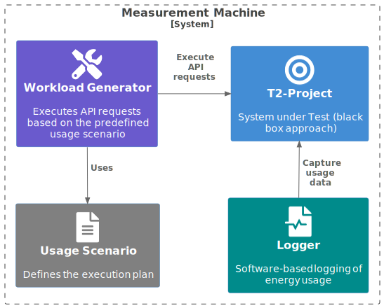

===================
Energy Measurements
===================

.. admonition:: WIP

   This is currently (April of 2024) under work in progress

How does the `T2-Project <https://github.com/t2-project/t2-project>`_ with a microservices architecture compare to the monolithic implementation `T2-Modulith <https://github.com/t2-project/modulith/>`_ in terms of energy consumption?

To answer this question we use different methodologies and tools to measure the energy consumption of both variants under various scenarios.

The files used for executing the measurements are located in the ``energy-tests`` folder of the `DevOps <https://github.com/t2-project/devops>`_ repository.

The following figure visualizes the basic procedure:

**Apache JMeter** is used as the load workload generator. It executes a predefined test plan that consists of multiple HTTP requests to the backend.
See page :doc:`JMeter <jmeter>` for more information.

There are currently *two measurement setups* prepared:

- :doc:`Green Metrics Tool <gmt>`
- :doc:`Kepler <kepler>`

| The **Green Metrics Tool** is used for measure the energy consumption with different usage case scenarios, however without scaling behaviors.
| **Kepler** is used for measurements in scenarios with scaling involved.

The results are discussed on the page :doc:`Measurement Results <results>`.
