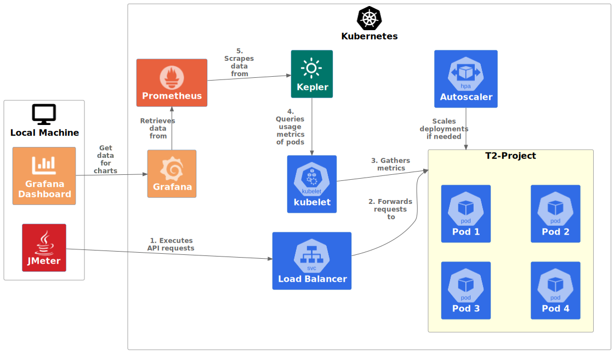

======
Kepler
======

We are using `Kepler <https://sustainable-computing.io/>`_ for measure the energy consumption in a Kubernetes cluster in scaling scenarios.

Setup
=====

The following visualizes the measurement setup with Kubernetes and Kepler in a simplified way.

Since we are using virtualized instances and no bare metal, Kepler cannot measure the energy consumption with RAPL or other hardware interfaces itself, but must estimate it with the help of usage metrics. With Grafana, the results can be presented visually in charts.

The setup for energy measurements with Kepler differs from the normal setup in the following points:

- Both variants, T2-Modulith and T2-Microservices, are operated in the same Kubernetes cluster in different namespaces. Measurements are only ever carried out with one system at a time, but the presence of both systems in the same cluster makes it easier to carry out different measurements quickly with both systems in sequence.
- The Grafana dashboard is made publicly accessible using an AWS load balancer, as there are often disconnections when using ``kubectl port-forward`` with Grafana.
- The UIBackend service is made publicly accessible using an AWS load balancer to get reliable load balancing for the API gateway. Local port forwarding with ``kubectl port-forward`` cannot be used as it does not support load-balancing and only forwards the requests to a pod.
- Autoscaling is set up appropriately for energy measurements.
- A compute-intensive scenario can be activated in which a compute-intensive operation is simulated during the *confirm order* operation. In the microservices system, this is done using an additional microservice called `computation-simulator <https://github.com/t2-project/computation-simulator>`__, which is called by the UIBackend service during the *confirm order* operation, and in the monolithic system, the optional calculation operation is implemented in a separate module, which is loaded via lazy loading as required.
- As with the setup with GMT, no CreditInstitute service is deployed. The payment is deactivated by configuration in order to be able to carry out reproducible measurements.
- The `Kubernetes resource management <https://kubernetes.io/docs/concepts/configuration/manage-resources-containers>`__ for individual containers (``requests`` and ``limits``) is adapted to optimize the utilization of the instances and to ensure better autoscaling.
- The size of the product inventory is increased to avoid too many simultaneous database operations on the same data set under heavy load.

The customizations are located in the GitHub repository `t2-project/devops <https://github.com/t2-project/devops>`__ in the subfolder ``energy-tests/k8s``. A script with the name ``aws-start-microservices-and-modulith.sh`` is available, which can handle the entire deployment including the customizations. `Kustomize <https://kustomize.io>`__ (``kubectl -k``) is used for the required modifications to the Kubernetes resources. This makes it possible to make specific adjustments to Kubernetes manifests without having to duplicate them.

Execution
=========

The execution of measurements with Kepler differs greatly from those with GMT. By using a usage scenario, GMT has a defined sequence of steps with a start and end point for the measurement. With Kepler, the execution of a scenario is decoupled from the measurement, which makes it more difficult to carry out measurements of individual scenarios.

Kepler automatically records the energy consumption of all containers operated in the same Kubernetes cluster at all times. The test plan is executed manually with JMeter independently of this. The energy consumption can then be tracked in the Grafana dashboard with a slight delay, almost in real time. It is not possible to determine the exact energy consumption for a scenario executed by JMeter. However, it is possible to compare different versions with different parameters using the graphs in Grafana.
