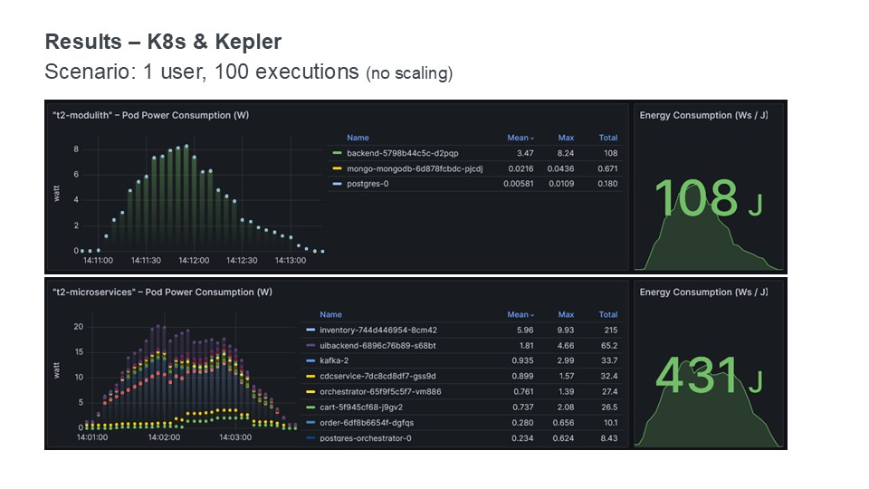
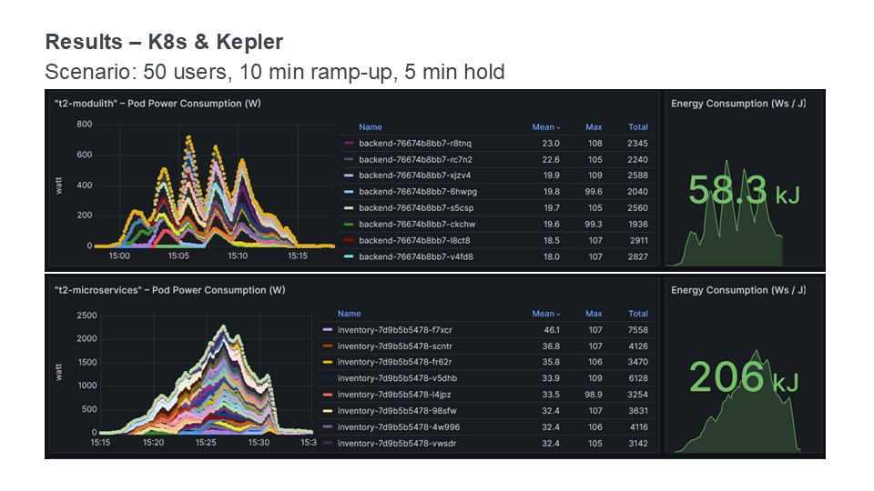
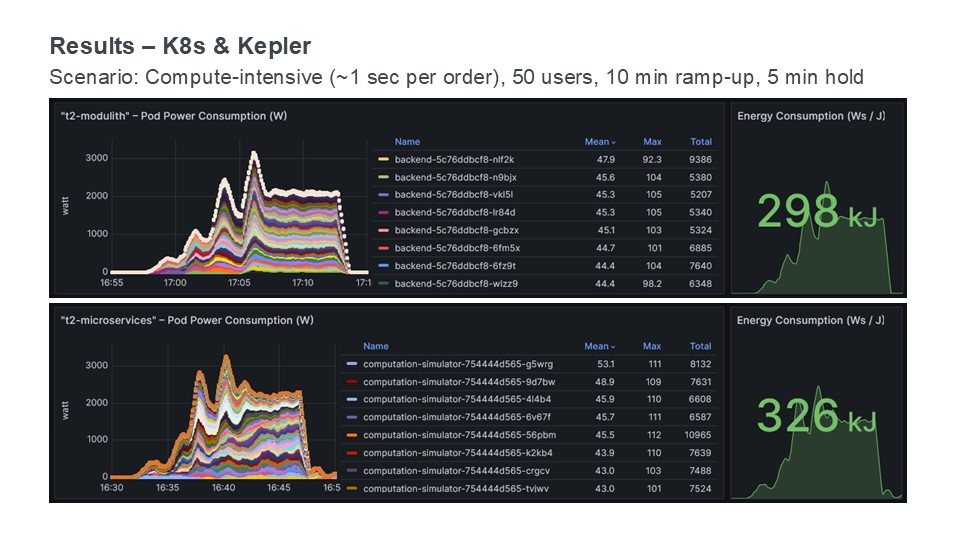

.. _measurement-results:

====================
Measurements Results
====================

This page deals with the measurement related to the main research question:
Under which scenarios is there a significant difference in energy consumption between the modulith and microservices implementation?

The measurement results listed on this page were generated with the :doc:`Green Metrics Tool <gmt>`. The values relate to the runtime phase, if not mentioned other. While using the Green Metrics Tool, many lessons were learned about what needs to be considered. Please have a look at the section :ref:`GMT Learnings <gmt-learnings>` before looking into the measurement results.

.. contents:: Overview
   :depth: 1
   :local:

Green Metrics Tool
------------------

**Research question:** What is more energy efficient in simple scenarios when no scaling is required, the modulith or microservices architecture style?

**Scenario:** One user executes multiple orders one after another.

The following table shows the results of eight measurement runs with the GMT, four with the modulith and four with the microservices system, using different configurations. There are two parameters that differ between the individual measurement runs: Number of sequential executions (0, 1 or 100) and think time between executions (0 or 1 second). In these scenarios, there is only ever one user who makes sequential requests, hence there are no parallel accesses. Think time is used as a parameter to include measurements when the machine is idle.

The measurement run in the microservices system with one execution (forth row in the table) took significantly longer than expected. This was due to the fact that JMeter took around ten seconds to start instead of the usual three seconds. A `repeated measurement run <https://metrics.green-coding.io/stats.html?id=e8f20671-32f3-44f8-9710-c665a42ae036>`__ also resulted in the same behavior. This shows that JMeter behaves unevenly at the start, which can have a negative impact on the results. The reasons for this are unclear.

Some load test scenarios were also tried out with the Green Metrics Tool (see other measurements runs below), but with the same end result: the monolith performs significantly better. However, this is hardly surprising, as horizontal scaling is not possible in the setup with GMT and therefore the microservices cannot utilize their potential advantages in this respect.

.. list-table::
  :header-rows: 1
  :stub-columns: 3

  * - Modulith / Microservices
    - Number of Executions
    - Think Time [s]
    - Duration [s]
    - Machine Energy [J]
    - CPU Energy [J]
    - Memory Energy [J]
    - Network Energy [J]
    - SCI [mgCO2e/order]
  * - `Modulith <https://metrics.green-coding.io/stats.html?id=f1e0171c-a5f6-4f24-b5e4-558fe334993c>`__
    - 0
    - 0
    - 3.81
    - 113.25
    - 53.19
    - 3.00
    - 0.00
    - N/A
  * - `Microservices <https://metrics.green-coding.io/stats.html?id=e6c84f8f-971e-4401-97b1-3cd75e57c4a9>`__
    - 0
    - 0
    - 4.01
    - 125.64
    - 55.92
    - 3.36
    - 0.46
    - N/A
  * - `Modulith <https://metrics.green-coding.io/stats.html?id=25614e23-d474-4953-a08b-3808f8e46fe6>`__
    - 1
    - 0
    - 5.82
    - 181.52
    - 85.83
    - 5.40
    - 1.02
    - 34.2
  * - `Microservices <https://metrics.green-coding.io/stats.html?id=59ed4330-d15b-465f-933c-9a7d966802f0>`__
    - 1
    - 0
    - 16.56
    - 441.30
    - 164.29
    - 14.00
    - 4.74
    - 87.3
  * - `Modulith <https://metrics.green-coding.io/stats.html?id=7e40ee3b-733e-4b66-aaba-e1e32a412a28>`__
    - 100
    - 0
    - 13.40
    - 393.86
    - 166.47
    - 13.51
    - 83.08
    - 0.8
  * - `Microservices <https://metrics.green-coding.io/stats.html?id=bf22a5c1-670b-4bd2-ba94-ad225cefe7c0>`__
    - 100
    - 0
    - 78.13
    - 1815.27
    - 572.10
    - 67.15
    - 330.28
    - 3.8
  * - `Modulith <https://metrics.green-coding.io/stats.html?id=c8aca13e-428a-4616-8677-93db8ebb0259>`__
    - 100
    - 1
    - 113.50
    - 1809.81
    - 254.30
    - 58.08
    - 84.94
    - 4.4
  * - `Microservices <https://metrics.green-coding.io/stats.html?id=a372a5ed-cb11-45bd-9b4c-8ad626f451bd>`__
    - 100
    - 1
    - 175.16
    - 3457.65
    - 808.74
    - 115.46
    - 345.57
    - 7.6
  
*Number of Executions and the Think Time are pre-configured values.*

The results of the measurements with the Green Metrics Tool show impressively that the monolithic system performs significantly better in the measured scenarios without scaling. This is mainly due to the fact that the microservices system takes longer to respond to the requests. For example, the scenario with 100 requests without think time only took 13 seconds for the monolith, while it took 78 seconds for the microservices system. The longer response times can be explained in particular by the overhead of network communication, as other studies comparing the performance of the two architectural styles have already shown.

The tested microservices system also performs worse at idle, as it causes a greater overall overhead due to the larger number of services and runtime environments, more databases and the additional middleware required for the message-based communication needed for saga (Kafka, Zookeeper, Eventuate CDC Service, Orchestrator). Therefore in the scenario with 0 executions GMT captured network energy transmission cost of 0.46 J.

Other GMT Measurements Runs
~~~~~~~~~~~~~~~~~~~~~~~~~~~

.. collapse:: <strong>30 seconds idle time</strong>

    **Scenario:** One user checks out the inventory, thinks for 30 sec, adds a random product to cart, thinks again, add a second product, thinks again, add a third product, and finally confirms the order.

    .. collapse:: <strong>Measurement</strong>
        :open:

        .. list-table::
          :header-rows: 1
          :stub-columns: 3

          * - Modulith / Microservices
            - Duration [s]
            - Machine Power [W]
            - Machine Energy [J]
            - CPU Energy [J]
            - Memory Energy [J]
            - Network Energy [J]
            - SCI [mgCO2e/order]
          * - `Modulith <https://metrics.green-coding.io/stats.html?id=50008066-07ef-438e-a727-dfcaf1d1c46b>`__
            - 95.72
            - 15.09
            - 1444.10
            - 161.28
            - 46.23
            - 2.47
            - 35.9
          * - `Microservices <https://metrics.green-coding.io/stats.html?id=b3352d36-ba6e-4b9e-9e67-3b5d345a7ff7>`__
            - 106.01
            - 18.05
            - 1913.97
            - 359.95
            - 60.35
            - 18.43
            - 43.9

.. collapse:: <strong>Load Tests</strong>

    **Important: The measurements have some problems and have to be fixed**

    * a long think time was used, so the average CPU usage in all scenario was quite low
    * asynchronous way of the order confirmation in the microservices scenario was not considered
    * compute-intensive component was missing

    **Research questions:**

    * What is more energy efficient in a load test scenario with many parallel users, modulith or microservices?
    * How relevant is the CPU, memory and network?

    **Scenario:** Many users in parallel: Each user checks out the inventory, think for 30-60 sec, add a random product to cart (3 times) and finally confirms the order. Logging of JMeter requests is disabled.

    **Findings:**

    * In these scenarios the Microservices system consumes a lot more energy
    * Comparison in scenario 100 users:
      - Machine Energy: 2949 J vs. 3891 J (+32 %)
      - CPU Energy: 1050 J vs. 370 J (+184 %)
      - Memory Energy: 95 J vs. 136 J (+43 %) 
      - Network Energy: 311 J vs. 717 J (+131 %)
      - CPU Mean: 7.5 % vs. 27.2 %
      - Memory Mean: 1144 MB vs. 3369 MB
    * Conclusion: This comparison is not fair → we need a more compute-intensive scenario

    .. collapse:: <strong>Durations</strong>

        .. list-table::
          :header-rows: 1
          :stub-columns: 2
          :align: left

          * - Modulith / Microservices
            - Number of Users
            - Ramp-up time (pre-configured) [s]
            - Duration [s]
          * - `Modulith <https://metrics.green-coding.io/stats.html?id=9c29b4e9-7ee5-416e-9be5-6d183f14e3fc>`__
            - 100
            - 2
            - 186.26
          * - `Microservices <https://metrics.green-coding.io/stats.html?id=ed9b2b05-740e-4769-a533-15e21154dbb0>`__
            - 100
            - 2
            - 185.92
          * - `Modulith <https://metrics.green-coding.io/stats.html?id=2737a2e8-677c-43c0-a167-57f7e9495160>`__
            - 300
            - 5
            - 175.22
          * - `Microservices <https://metrics.green-coding.io/stats.html?id=2c2f7111-9eaf-42be-854a-3ccb71f41241>`__
            - 300
            - 5
            - 182.88

        All measurement runs with modulith system:

        .. list-table::
          :header-rows: 1
          :stub-columns: 2
          :align: left

          * - Modulith
            - Number of Users
            - Ramp-up time (pre-configured) [s]
            - Duration [s]
          * - `Modulith <https://metrics.green-coding.io/stats.html?id=9c29b4e9-7ee5-416e-9be5-6d183f14e3fc>`__
            - 100
            - 2
            - 186.26
          * - `Modulith <https://metrics.green-coding.io/stats.html?id=eb85a781-4e7b-4570-a7bb-b9cd98ab7ebb>`__
            - 200
            - 2
            - 181.97
          * - `Modulith <https://metrics.green-coding.io/stats.html?id=2737a2e8-677c-43c0-a167-57f7e9495160>`__
            - 300
            - 5
            - 175.22
          * - `Modulith <https://metrics.green-coding.io/stats.html?id=1797131a-8bf2-44af-a845-f5fc462e6de0>`__
            - 400
            - 5
            - 180.08
          * - `Modulith <https://metrics.green-coding.io/stats.html?id=d213415f-584c-407e-ab3b-ebc7c911df30>`__
            - 500
            - 5
            - 182.32

    .. collapse:: <strong>Energy Consumption</strong>

        .. list-table::
          :header-rows: 1
          :stub-columns: 2
          :align: left

          * - Modulith / Microservices
            - Number of Users
            - Machine Power [W]
            - Machine Energy [J]
            - CPU Energy [J]
            - Memory Energy [J]
            - Network Energy [J]
          * - `Modulith <https://metrics.green-coding.io/stats.html?id=9c29b4e9-7ee5-416e-9be5-6d183f14e3fc>`__
            - 100
            - 15.83
            - 2949.27
            - 370.25
            - 94.94
            - 311.21
          * - `Microservices <https://metrics.green-coding.io/stats.html?id=ed9b2b05-740e-4769-a533-15e21154dbb0>`__
            - 100
            - 20.93
            - 3891.40
            - 1050.28
            - 135.97
            - 717.14
          * - `Modulith <https://metrics.green-coding.io/stats.html?id=2737a2e8-677c-43c0-a167-57f7e9495160>`__
            - 300
            - 17.18
            - 3009.78
            - 513.25
            - 100.76
            - 1608.60
          * - `Microservices <https://metrics.green-coding.io/stats.html?id=2c2f7111-9eaf-42be-854a-3ccb71f41241>`__
            - 300
            - 24.57
            - 4493.86
            - 1525.81
            - 173.44
            - 2402.92

        All measurement runs with modulith system:

        .. list-table::
          :header-rows: 1
          :stub-columns: 2
          :align: left

          * - Modulith
            - Number of Users
            - Machine Power [W]
            - Machine Energy [J]
            - CPU Energy [J]
            - Memory Energy [J]
            - Network Energy [J]
          * - `Modulith <https://metrics.green-coding.io/stats.html?id=9c29b4e9-7ee5-416e-9be5-6d183f14e3fc>`__
            - 100
            - 15.83
            - 2949.27
            - 370.25
            - 94.94
            - 311.21
          * - `Modulith <https://metrics.green-coding.io/stats.html?id=eb85a781-4e7b-4570-a7bb-b9cd98ab7ebb>`__
            - 200
            - 16.42
            - 2990.24
            - 449.09
            - 99.10
            - 844.34
          * - `Modulith <https://metrics.green-coding.io/stats.html?id=2737a2e8-677c-43c0-a167-57f7e9495160>`__
            - 300
            - 17.18
            - 3009.78
            - 513.25
            - 100.76
            - 1608.60
          * - `Modulith <https://metrics.green-coding.io/stats.html?id=1797131a-8bf2-44af-a845-f5fc462e6de0>`__
            - 400
            - 17.66
            - 3180.31
            - 610.23
            - 108.03
            - 2588.05
          * - `Modulith <https://metrics.green-coding.io/stats.html?id=d213415f-584c-407e-ab3b-ebc7c911df30>`__
            - 500
            - 18.43
            - 3360.63
            - 687.72
            - 113.05
            - 3781.67

    .. collapse:: <strong>CPU Utilization & Memory Usage</strong>

        Note: JMeter is part of ``system``

        .. list-table::
          :header-rows: 1
          :stub-columns: 1
          :align: left

          * - Modulith / Microservices
            - Number of Users
            - ``system`` CPU Mean [%]
            - ``system`` CPU Max [%]
            - ``system`` Memory Sum Mean [MB]
            - ``system`` Memory Sum Max [MB]
            - ``system`` Memory Sum Min [MB]
          * - `Modulith <https://metrics.green-coding.io/stats.html?id=9c29b4e9-7ee5-416e-9be5-6d183f14e3fc>`__
            - 100
            - 7.52
            - 100.00
            - 1144.43
            - 1199.25
            - 741.55
          * - `Microservices <https://metrics.green-coding.io/stats.html?id=ed9b2b05-740e-4769-a533-15e21154dbb0>`__
            - 100
            - 27.23
            - 100.00
            - 3368.59
            - 3648.12
            - 2708.28
          * - `Modulith <https://metrics.green-coding.io/stats.html?id=2737a2e8-677c-43c0-a167-57f7e9495160>`__
            - 300
            - 14.50
            - 100.00
            - 961.48
            - 1025.16
            - 490.38
          * - `Microservices <?>`__
            - 300
            - 43.17
            - 100.00
            - 3553.26
            - 3829.44
            - 2670.32

        All measurement runs with modulith system:

        .. list-table::
          :header-rows: 1
          :stub-columns: 1
          :align: left

          * - Modulith
            - Number of Users
            - ``system`` CPU Mean [%]
            - ``system`` CPU Max [%]
            - ``system`` Memory Sum Mean [MB]
            - ``system`` Memory Sum Max [MB]
            - ``system`` Memory Sum Min [MB]
          * - `Modulith <https://metrics.green-coding.io/stats.html?id=9c29b4e9-7ee5-416e-9be5-6d183f14e3fc>`__
            - 100
            - 7.52
            - 100.00
            - 1144.43
            - 1199.25
            - 741.55
          * - `Modulith <https://metrics.green-coding.io/stats.html?id=eb85a781-4e7b-4570-a7bb-b9cd98ab7ebb>`__
            - 200
            - 10.83
            - 100.00
            - 956.88
            - 1022.09
            - 505.19
          * - `Modulith <https://metrics.green-coding.io/stats.html?id=2737a2e8-677c-43c0-a167-57f7e9495160>`__
            - 300
            - 14.50
            - 100.00
            - 961.48
            - 1025.16
            - 490.38
          * - `Modulith <https://metrics.green-coding.io/stats.html?id=1797131a-8bf2-44af-a845-f5fc462e6de0>`__
            - 400
            - 17.15
            - 100.00
            - 1041.08
            - 1132.27
            - 536.1
          * - `Modulith <https://metrics.green-coding.io/stats.html?id=d213415f-584c-407e-ab3b-ebc7c911df30>`__
            - 500
            - 19.97
            - 100.00
            - 1104.04
            - 1202.52
            - 507.04

Kepler
------

**Research question:** What is more energy efficient in scenarios with scaling involved, the modulith or microservices architecture style?

First we run the same scenario with Kepler without any scaling involved.
The following slide shows the comparison between two measurement runs, one with the modulith variant and one with the microservices variant.

The duration of the scenario execution was 2min 30s for the modulith variant and 3 min for the microservices variant.
The Kubernetes CPU resource requests and limits were both set to 1.5 cores for the modulith variant and 0.25 cores for each microservice.
In such a scenario with no scaling involved the modulith is faster and is much more energy efficient.

To measure energy consumption during scaling, we use a scenario with 50 parallel users, a 10-minute linear ramp-up duration, and a 5-minute duration with constant load on all users.
The following slide shows the result of this scenario.

In this scenario the modulith variant still has a much smaller energy footprint than the microservices variant.
The main reason is, that the modulith variant is much faster and doesn't have the overhead of the saga workflow.

The peaks in the modulith energy consumption graph are caused by starting multiple instances at the same time.
It would be much better if the scaling would be smoother without such peaks.
So there is definitely room for improvement. 

What the result already shows, however, is that in the T2-Project, the microservices variant has fundamental disadvantages in terms of performance and energy efficiency compared to the modulith variant due to the saga pattern.

The microservices variant can only show the advantages of better scalability when more computing is required and communication is no longer the bottleneck.
To illustrate such a scenario, a compute-intensive scenario will now be simulated.
A calculation task is added to the order process that takes approximately 1 second.
With the modulith variant, the task is integrated directly; with the microservices variant, it is outsourced to a separate service called `compute-simulator`.
The following slide shows the result.
Although the modulith is still slightly more energy-efficient, the gap is now significantly smaller.
It can be assumed that with further adjustments to the scenario, the microservices variant could perform better at some point.

Conclusion
----------

In summary, it can be said that the modulith variant performs significantly better than the microservices variant in the given scenario of the T2-Project.
Firstly, the monolithic system is much easier to handle than the microservices system with the saga pattern and the middleware components required for communication. Secondly, the modulith also has significantly better energy efficiency. The microservices variant has disadvantages due to the communication overhead, especially due to the saga pattern. Only in a compute-intensive scenario with dynamic scaling does the microservices variant have certain advantages and can potentially perform better under high load.
