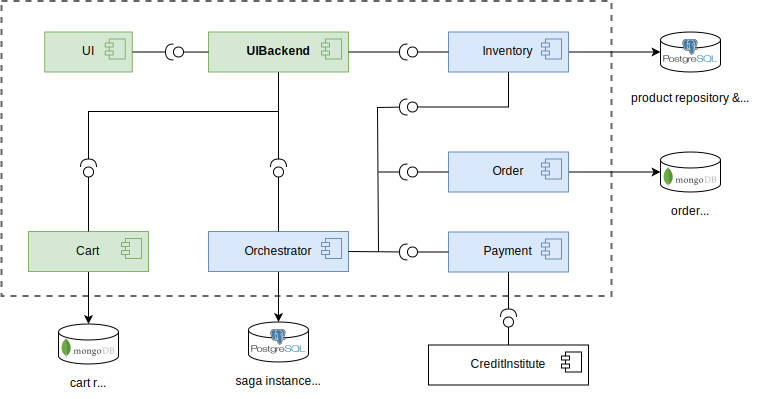

=======================
T2-Project Architecture
=======================

The T2-Project consists of seven services.

The green and blue services are the core T2 services. The blue ones participate in the saga, the green ones do not. 
The white things are databases and external services.  

*  `UI <https://github.com/t2-project/ui>`__ : The application frontend.
*  `UIBackend <https://github.com/t2-project/uibackend>`__ : API Gateway for the UI.
*  `Cart <https://github.com/t2-project/cart>`__ : Manages the user shopping carts. It saves the cart contents to the *cart repository*.
*  `Orchestrator <https://github.com/t2-project/orchestrator>`__ : Manages the saga.
*  `Order <https://github.com/t2-project/order>`__ : Persists orders to the *order repository* and marks them as either *success* or *failure*.
*  `Payment <https://github.com/t2-project/payment>`__ : Handles the store’s payment by contacting some credit institute.
*  `Inventory <https://github.com/t2-project/inventory>`__ : Manages the store's products. They are stored in the *product repository*.

The UIBackend communicates over HTTP with a REST like interface.
The Saga participants (marked in blue) use message based communication among each other. 
This is necessary because of the saga pattern. 

The T2-Project realizes the following business process:

The activities within the *Saga* subprocess must be executed as a transaction.
The transaction is implemented according to the `Saga Pattern <https://microservices.io/patterns/data/saga.html>`__.

The T2-Project's services realise the activities of the business process like this:

============    ========================================================
Service	        Activity
============    ========================================================
Cart            add item to cart
Inventory       add reservation, delete reservation, commit reservation
Order           create order, reject order
Payment         do payment            
Orchestrator    confirm order
============    ========================================================

Saga
====

The T2-Project's saga is composed of the following steps: 

====  =========  ====================  ========================
Step	Service	  Transaction           Compensation 
====  =========  ====================  ========================
1     Inventory                        cancelReservations()	
2     Order      createOrder()         rejectOrder()
3     Payment    doPayment()           
4     Inventory  commitReservations()  
====  =========  ====================  ========================

The doPayment() step is the saga's pivot transaction.
If this step succeeds, the saga runs to completion. 

The step commitReservations() is designed to be retrieable. 
It will succeed eventually. 

The same applies to the compensations rejectOrder() and cancelReservations().

Every order is persisted, those that succeeded as well as those that failed.
An order holds, among other details, the order state.
Upon creation the order state is set to *success*. 
As all orders should be persisted, the compensation of creating an order is to set its state to *failed*.
Currently an order cannot be cancelled after submission to the orchestrator. 

The inventory manages the number of available units per product. 
If the inventory decreases the number of available units only after placing the order, the product may not be available anymore because another user bought to many units of that product. 
To prevent such failures the ordered units of a product are locked as soon as they are placed in the shopping cart.
As there is now no action to perform on the inventory before the pivot transaction (do payment), there is only the compensation that deletes the reservation (in case the saga rolls back) or the step commitReservations() that handles served reservations. 

Frameworks & Dependencies
=========================

The T2-Project uses the following frameworks (and services):

Spring and Spring Boot
----------------------

=================== ==============
Dependency          Version
=================== ==============
Spring Boot         3.1.x
=================== ==============

Eventuate Tram and Eventuate Tram Saga
--------------------------------------

`Eventuate Tram <https://github.com/eventuate-tram/eventuate-tram-core>`__ is a framework for Transactional Messaging and `Eventuate Tram Sagas <https://github.com/eventuate-tram/eventuate-tram-sagas>`__ is a framework for saga orchestration.
They are both work on top of Spring / Spring Boot. 
The T2-Project uses the Eventuate Tram Core framework with Kafka as the message broker and Postgres as the database.

Versions
^^^^^^^^

======================= ==============
Dependency              Version
======================= ==============
io.eventuate.tram.core  0.29.0.RELEASE
io.eventuate.tram.sagas 0.18.0.RELEASE
======================= ==============

Eventuate CDC Service
---------------------

The `Eventuate CDC Service <https://eventuate.io/docs/manual/eventuate-tram/latest/cdc-configuration.html>`__ realizes the `Transactional Outboxing Pattern <https://microservices.io/patterns/data/transactional-outbox.html>`__ required by the Saga Pattern.

================================== ==============
Dependency                         Version
================================== ==============
eventuateio/eventuate-cdc-service  latest
================================== ==============

Message Broker
--------------

The T2-Project uses Kafka and Zookeeper as message broker.

Saga Database
-------------

The T2-Project uses a Postgres Database for the saga data. 
It uses the Postgres image from `eventuateio <https://hub.docker.com/r/eventuateio/eventuate-postgres>`__ because it already contains the tables required for the transactional outboxing.

Domain Database
---------------

The T2-Project uses MongoDBs and a Postgres Database as databases for the domain data.
The *cart repository* and the *order repository* are MongoDBs.
The *product repository* is a Postgres Database. 

Services
========

All Services are implemented as `Spring Boot <https://spring.io/projects/spring-boot>`__ Applications.
This is the services' general package structure:

*  :file:`de.unistuttgart.t2.<service-name>`
*  :file:`de.unistuttgart.t2.<service-name>.saga`
*  :file:`de.unistuttgart.t2.<service-name>.repository`
*  :file:`de.unistuttgart.t2.<service-name>.exception`
*  :file:`de.unistuttgart.t2.<service-name>.domain`

Each service has a subset of those packages, as visualized in the diagram below.
The diagram reads as follows: 
Orchestrator has the *<service-name>* package and a packages *saga*, Order and Inventory have those packages and also a package *repository*, and so on.

de.unistuttgart.t2.<service-name>
---------------------------------

The app package contains the following classes, usually prefixed with the service name.
E.g the application class of the Order Service is called *OrderApplication*, the controller is called *OrderController* and so on.

*  Application : annotated with @SpringBootApplication. 
*  Service : contains the logic of the service.
*  Controller : defines the HTTP endpoint of the service. 
   This class is only present, if the service has HTTP endpoints.

Services with complicated configurations have an additional config package that contains the various configuration classes.

de.unistuttgart.t2.<service-name>.saga
------------------------------------------------

The saga package contains classes that are saga specific.
For the participants: 

* CommandHandler : handles incoming messages.

For the orchestrator:

* Saga : definition of the saga.

de.unistuttgart.t2.<service-name>.repository
-------------------------------------------------

The repository packages contain all classes and interfaces for the domain databases.

* Item : the items in the database.
* Repository : an Interface that extends Spring's `MongoRepository <https://docs.spring.io/spring-data/mongodb/docs/current/api/org/springframework/data/mongodb/repository/MongoRepository.html>`__ to access the database.

de.unistuttgart.t2.<service-name>.exceptions
------------------------------------------------------

Any kind of service specific exceptions can be found here.

de.unistuttgart.t2.<service-name>.domain
------------------------------------------

Any classes that represent something domain specific, but does not belong into the repository package. 
Most domain specific things are used by multiple services and thus located in the common package, however things that only one service needs are located here.

Links
=====

For more Details on each service, look at the repositories or the API documentation:

*  Order service: `GitHub <https://github.com/t2-project/order>`__
*  Inventory service: `GitHub <https://github.com/t2-project/inventory>`__
*  Payment service: `GitHub <https://github.com/t2-project/payment>`__
*  Orchestrator service: `GitHub <https://github.com/t2-project/orchestrator>`__
*  Cart service: `GitHub <https://github.com/t2-project/cart>`__
*  Credit Institute service: `GitHub <https://github.com/t2-project/creditinstitute>`__
*  UIBackend : `GitHub <https://github.com/t2-project/uibackend>`__
*  UI : `GitHub <https://github.com/t2-project/ui>`__

*  Common: `GitHub <https://github.com/t2-project/common>`__
*  E2E Test: `GitHub <https://github.com/t2-project/e2e-tests>`__
