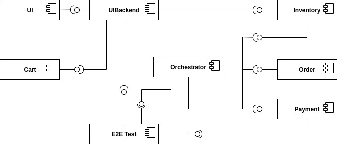

======================
T2-Project Deployment
======================

| This section describes two ways to deploy the T2-Project.
| Either on a Kubernetes cluster or as Docker containers with Docker Compose.
| The container images for the T2-Projects services come from `here <https://hub.docker.com/r/t2project>`__ at Docker Hub.
| The images for the services from eventuate come also from Docker Hub: `eventuateio <https://hub.docker.com/u/eventuateio>`__

This section also describes how to build and run the T2-Projects services locally, however this is discouraged unless you want to develop.

Deploy on a Kubernetes Cluster
========================================

Get Helm Charts
---------------

This section describes how to deploy the T2-Project on a Kubernetes cluster.

The T2-Project needs Kafka and a MongoDB. Install them any way you want to, e.g. from helm charts:

.. code-block:: shell

   helm repo add bitnami https://charts.bitnami.com/bitnami
   helm repo update
   helm install mongo --set auth.enabled=false bitnami/mongodb
   helm install kafka bitnami/kafka

Deploy the T2-Project
---------------------

| In case you want to name the deployed releases differently, you must adapt some environment variables in the T2-Project deployments.
| Confer the services' READMEs for more details regarding the setting of the services' properties.

For the T2-Project itself get the deployments and deploy them:

.. code-block:: shell

   git clone https://github.com/t2-project/devops.git
   cd devops/k8
   kubectl create -f .

These commands should deploy 10 services in addition to the MongoDB, the Kafka and the Zookeeper instances.

Configuring the database
------------------------

| The T2-Project uses a PostgreSQL pod as its database.
| If you want to configure it, download the `postgres config <https://raw.githubusercontent.com/t2-project/devops/main/k8/postgresql.conf>`__ and store it under the name :file:`postgresql.conf` (should automatically be downloaded as that).
| Change the configuration to your liking, or simply use the provided defaults.
| Then, you can set it for your cluster using

.. code-block:: shell

   kubectl create configmap postgres-config --from-file postgresql.conf

Access the T2-Project
---------------------

| The UI is available through the service :file:`ui-cs`.
| To access it forward that service to your local machine:

.. code-block:: shell

   kubectl port-forward svc/ui-cs 8086:80

And open `<http://localhost:8086>`__.

| You can also skip the UI and access the service via Swagger-UI.
| To do that, forward the port of your target service, as an example :file:`uibackend-cs`:

.. code-block:: shell

   kubectl port-forward svc/uibackend-cs 8081:80

And open `<localhost:8081/swagger-ui.html>`__.

This also works for the services :file:`inventory-cs`, :file:`orchestrator-cs`, :file:`cart-cs` and :file:`creditinstitute-cs`.

.. code-block:: shell

   kubectl port-forward svc/inventory-cs 8082:80 &
   kubectl port-forward svc/orchestrator-cs 8085:80 &
   kubectl port-forward svc/cart-cs 8080:80 &
   kubectl port-forward svc/creditinstitute-cs 8087:80 &

*  Inventory : `<localhost:8082/swagger-ui.html>`__
*  Orchestrator : `<localhost:8085/swagger-ui.html>`__
*  Cart : `<localhost:8080/swagger-ui.html>`__
*  Credit Institute : `<localhost:8087/swagger-ui.html>`__

Now go to page :doc:`Usage <use>` to figure out what you can do with the T2-Project.

Prometheus setup
-----------------

| Beware: the T2-Project is instrumented to provide metrics, but you must still set up the actual monitoring yourself.
| (If you are on Docker, you are on you own.)

The following instructions rely on the Helm charts from the Prometheus community.

.. code-block:: shell

   # add repo for prometheus
   helm repo add prometheus-community https://prometheus-community.github.io/helm-charts

   # get files to customize chart values
   wget https://raw.githubusercontent.com/t2-project/devops/main/prometheusfiles/prometheus-operator-values.yaml
   wget https://raw.githubusercontent.com/t2-project/devops/main/prometheusfiles/prometheus-blackbox-exporter-values.yaml

   # install charts
   helm install prometheus prometheus-community/kube-prometheus-stack -f ./prometheus-operator-values.yaml
   helm install blackbox-exporter prometheus-community/prometheus-blackbox-exporter -f ./prometheus-blackbox-exporter-values.yaml

Autoscaling setup
-----------------

| To unlock the autoscaling capabilities of the T2-Project, ensure that all prior steps except for the Prometheus setup were completed successfully.
| Additionally, the `metrics server <https://github.com/kubernetes-sigs/metrics-server>`__ must have been set up and working.

Metrics Server setup
~~~~~~~~~~~~~~~~~~~~

There are two ways to install the metrics server:

* Install the `Helm Chart <https://artifacthub.io/packages/helm/metrics-server/metrics-server>`__
* Install `manually <https://github.com/kubernetes-sigs/metrics-server#installation>`__

If you use `Minikube <https://minikube.sigs.k8s.io/docs/>`__, there is a third way to install the metrics server:

.. code-block:: shell

   minikube addons enable metrics-server

Should you encounter an error with your metrics server, `this article <https://www.linuxsysadmins.com/service-unavailable-kubernetes-metrics/>`__ might be helpful.

The metrics server is running as intended when the command

.. code-block:: shell

   kubectl top pod

does not throw an error.

If you are on Minikube and still encounter an error, there is one more known troubleshooting solution:

.. code-block:: shell

   minikube stop
   minikube start --extra-config=kubelet.housekeeping-interval=10s

If your metrics server still won't work, good luck fixing it.

Creating the autoscaling behavior
~~~~~~~~~~~~~~~~~~~~~~~~~~~~~~~~~

Afterwards, navigate to the :file:`k8/autoscaling` directory in the `DevOps repo <https://github.com/t2-project/devops>`__ and create all resources inside:

.. code-block:: shell

   kubectl create -f .

Modifying the autoscaling behavior
~~~~~~~~~~~~~~~~~~~~~~~~~~~~~~~~~~

If you want to modify the autoscaling behavior, i.e. by increasing the maximum replicas, add the change in the corresponding :file:`hpa_$SERVICE.yaml` file there, and apply it by calling

.. code-block:: shell

   kubectl delete horizontalpodautoscalers.autoscaling $SERVICE
   kubectl create -f .

Run with Docker
===============

You can run the T2-Project as Docker containers.

.. code-block:: shell

   git clone https://github.com/t2-project/devops.git
   cd devops/docker
   docker-compose up -d

These commands should deploy 13 services in total.

| You can now access the UI at `<http://localhost:8086>`__.
| You can also access some services via Swagger-UI, as listed below (assuming that you did not change the mapped ports):

*  UIBackend : `<localhost:8081/swagger-ui.html>`__
*  Inventory : `<localhost:8082/swagger-ui.html>`__
*  Orchestrator : `<localhost:8085/swagger-ui.html>`__
*  Cart : `<localhost:8080/swagger-ui.html>`__
*  Credit Institute : `<localhost:8087/swagger-ui.html>`__

Now go to page :doc:`Usage <use>` to figure out what you can to with the T2-Project.

Build and Run Locally
=====================

| You can build and run the entire T2-Project locally.
| This is most likely not relevant to you.

| The following guide describes how to this with the Order service as an example.
| You can build all other services (with minor exceptions) the same way.
| You just need to replace 'order' with the respective service name.

| If you want to build all services at once, you can use the script ``build-all.sh`` provided in the :file:`devops` repository.

Step 0 : Clone Repositories
----------------------------------------------------

.. code-block:: shell

   git clone --recursive https://github.com/t2-project/t2-project.git
   # Or if an SSH key has been registered with GitHub:
   git clone --recursive git@github.com:t2-project/t2-project.git
   # Or to only download the order repo:
   git clone https://github.com/t2-project/order.git

Step 1 : Versions and Environment Variables
----------------------------------------------------

The T2-Project is build with the following dependencies and tools. 
There is no guarantee that it works with others as well. 

======================= ==========================
Name                    Version
======================= ==========================
Maven                   ``3.9.5``
Docker                  ``24.0.6``
Spring Boot             ``3.1.5``
io.eventuate.tram.core  ``0.34.0.RELEASE``
io.eventuate.tram.sagas ``0.23.0.RELEASE``
jaeger                  ``3.3.1``
resilience4j            ``2.1.0``
springdoc               ``2.2.0``
======================= ==========================

The :file:`pom.xml` files read the versions from environment variables.
That means you either have to manually export the versions into environment variables, or you source the `setenv.sh <https://github.com/t2-project/devops/blob/main/setenv.sh>`__ file. There are also files for Windows users: `setenv.cmd <https://github.com/t2-project/devops/blob/main/setenv.cmd>` and `setenv.ps1 <https://github.com/t2-project/devops/blob/main/setenv.ps1>`.

.. code-block:: shell

   wget https://raw.githubusercontent.com/t2-project/devops/main/setenv.sh
   . ./setenv.sh

Step 2 : Set Application properties
----------------------------------------

Set the `application properties <https://github.com/t2-project/order/tree/main/src/main/resources>`__.
They are located at :file:`./src/main/resources/`
You want to consult the service's README on the meaning of the properties.

Step 3 : Build Local Dependencies
------------------------------------------

Most services of the T2-Project depend on `common <https://github.com/t2-project/common>`__, thus you need to install that first:

.. code-block:: shell

   git clone https://github.com/t2-project/common.git
   cd common/
   ./mvnw clean install

Step 2.1 : Exceptions for Service E2E Test
~~~~~~~~~~~~~~~~~~~~~~~~~~~~~~~~~~~~~~~~~~

The E2E Test also depends on the saga participants *inventory*, *payment* and *order*.

You must build and install them to your local maven repository as well.

.. code-block:: shell

   git clone https://github.com/t2-project/payment.git
   cd payment/
   ./mvnw clean install
   ./mvnw install:install-file -Dfile=./target/payment-0.0.1-SNAPSHOT.jar.original

.. code-block:: shell

   git clone https://github.com/t2-project/inventory.git
   cd inventory/
   ./mvnw clean install
   ./mvnw install:install-file -Dfile=./target/inventory-0.0.1-SNAPSHOT.jar.original

.. code-block:: shell

   git clone https://github.com/t2-project/order.git
   cd order/
   ./mvnw clean install
   ./mvnw install:install-file -Dfile=./target/order-0.0.1-SNAPSHOT.jar.original

Step 4 : Build and Run
----------------------

Now you can build and run the order service.

.. code-block:: shell

   cd order/
   ./mvnw spring-boot:run

Or like this, in case you want to supply specific application properties (remember to use the path to *your* properties file).

.. code-block:: shell

   cd order/
   ./mvnw clean install
   java -jar -Dspring.config.location=./src/main/resources/application.local.properties ./target/order-0.0.1-SNAPSHOT.jar

Of course, you can also use own profiles like e.g. *local* (:file:`./src/main/resources/application-local.yml` is used automatically, if created):

.. code-block:: shell

   cd order/
   ./mvnw clean install
   java -jar -Dspring.profiles.active=local ./target/order-0.0.1-SNAPSHOT.jar

Step 5 : Build Docker Image
---------------------------

Each service repository contains a Dockerfile to build an image of that service.

Run with Test Service
=======================

The *Test* service intercepts request from the *UI Backend* to the *Orchestrator* and also snatches the requests from the *Payment* service to the *Credit Institute* and answers them in the *Credit Institute's* stead.
The setup is depicted below.
With this setup, the *Test* service knows the supposed outcome of all requests and can assert that the databases are in the correct state, after a saga instance finished.

For more details, see the `Test Service's README <https://github.com/t2-project/e2e-tests>`__.

Step by Step
------------

#. Run the E2E Test Service
#. Configure the UI Backend and the Payment Service
#. Generate load
#. Look at the logs

Step 1 : Run E2E Test Service
-----------------------------

Run the `E2E Test Service <https://github.com/t2-project/e2e-tests>`__.
If you are on a Kubernetes cluster, you may apply the deployment from the folder :file:`testsetup/` in the :file:`devops` repository.

.. code-block:: shell

   kubectl apply -f testsetup/e2etest.yaml

Step 2 : Configure the UI Backend and the Payment Service
---------------------------------------------------------

Configure the *UI Backend* such that it sends confirmed orders to the *Test* service and configure the *Payment* service to send the payment requests to the *Test* service.

For Kubernetes
~~~~~~~~~~~~~~

In the UI Backend Deployment (:file:`uibackend.yml`):

.. code-block:: yaml

   - name: T2_ORCHESTRATOR_URL
     value: http://<e2e-test-host>/test/

In the Payment Deployment (:file:`payment.yml`):
   
.. code-block:: yaml

   - name: T2_PAYMENT_PROVIDER_DUMMY_URL
     value: http://<e2e-test-host>/fakepay

In both cases replace :file:`<e2e-test-host>` with the location of the Test Service.

Or use the deployment in the folder `testsetup <https://github.com/t2-project/devops/tree/main/testsetup>`__ because there the environment variables are already set as described above. 

Step 3 : Generate Load
-----------------------------

Refer to the following section for information on how to create a load.
There must be some request or else there is nothing to test.
The *Test* service does not generate load by itself.

Step 4 : Look at the Logs
-----------------------------

The test results are printed to the logs.
This might change but for now it is the easiest solution.

For Kubernetes
~~~~~~~~~~~~~~

.. code-block:: shell

   kubectl logs <e2etest-pod>

Interpret Output
~~~~~~~~~~~~~~~~

A test report contains these information:

*  **Expected Saga Status** : If it is :file:`FAILURE` then the saga instance supposed to have rolled back, other wise it should have run to completion.
*  **Saga Id** : Id of the Saga instance in the Saga instance DB. Used to look the Saga instance up.
*  **Correlation Id** : Id used by the test service to correlate saga request to the Orchestrator with payment request from the Payment Service.
*  **Order**, **Inventory**, **Saga Instance** : Displays the test result for the Order and Inventory service and the Saga instance.

Report for rest that found every thing correct:

.. code-block:: text

   Test Report:
       Expected Saga Status: FAILURE
       Saga Id: 000001796a7b7be5-7aef648a26a50000 Correlation Id: B42A90324D7639C1BCCC7A5E60080504
        Order: correct
        Inventory: correct
        Saga Instance: correct

Report for test that found that some entries in the inventory database were not deleted correctly:

.. code-block:: text

   Test Report:
       Expected Saga Status: SUCCESS
       Saga Id: 000001796a7b7bde-7aef648a26a50000 Correlation Id: A79799BA296DF9035A11D1FF553D1AD2
        Order: correct
        Inventory : reservations for sessionId A79799BA296DF9035A11D1FF553D1AD2 not deleted. ==> expected: <false> but was: <true>
        Saga Instance: correct
