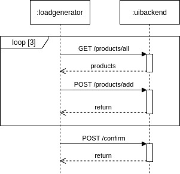
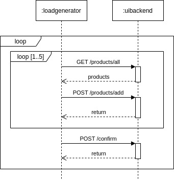

======================
T2-Project Usage
======================

The T2-Project main point of usage is to trigger SLO violations with regard to response time and availability.
For that we need:

- :ref:`autoscaling`
- :ref:`monitoring`
- :ref:`trigger`
- :ref:`generate`

.. _autoscaling:

Influencing autoscaling behavior
================================

| Assuming you set up the T2-Project on a platform that enables autoscaling (-> **Kubernetes**), you can use the *autoscaling management routes* to influence the autoscaling behavior of every service.
| You can also use them otherwise, but what's the point of creating a *memory leak*/ *Denial of Service* if you don't use it?
| These routes offer exactly that:
| They are located under :file:`/autoscaling/` and offer functionality from disallowing all requests outside this directory (:file:`/autoscaling/(un)block-routes`) over setting a minimal percentage of memory to use at all times (:file:`/autoscaling/require-memory/ratio-{memory}`, :file:`/autoscaling/require-memory/{memory}-percent`, :file:`/autoscaling/(clear|disable)-memory-leak`) to setting a minimal amount of CPU to use (:file:`/autoscaling/require-cpu-from-humans`, :file:`/autoscaling/require-cpu`, :file:`/autoscaling/remove-cpu-usage-requirements`).
| :file:`/autoscaling/require-memory/ratio-{memory}` requires the memory as mathematical ratio, so for example ``memory = 0.5`` means ``use 50% of the available memory``. ``0`` keeps the current memory leak without ensuring that the previously set percentage is kept, negative values clear the leak.
| :file:`/autoscaling/require-memory/{memory}-percent` does the same except it expects literal percents, so for example ``memory = 50.0`` means ``use 50% of the available memory`` as well.
| :file:`/autoscaling/(clear|disable)` are simply convenience routes so that you don't have to know which value to send.
| The same principles apply to the CPU routes except the upper boundary is now ``numberOfCores * 1.0`` (or ``numberOfCores * 100.0`` for the human route).
| More information about these routes can be found in the swagger files (:file:`/swagger-ui.html`).

.. _monitoring:

Monitoring
==========

Instrumentation (Provided Metrics)
----------------------------------

The T2-Project's services are instrumented with `Micrometer <https://micrometer.io/>`__ for monitoring with `Prometheus <https://prometheus.io/>`__.

Each service, except the CDC service, which is provided by eventuate, expose prometheus metrics at the endpoint :file:`/actuator/prometheus>`.
Assuming you followed the instructions under :doc:`Deployment <deploy>` for either a deployment with Kubernetes or Docker Compose, and thus have the :file:`creditinstitute` service available at :file:`localhost:8087`, go to `<localhost:8087/actuator/prometheus>`__ to get the metrics of the credit institute service.
Change the port according to your deployment to see the metrics of the other services.

For the :file:`creditinstitute` service, the most interesting metrics are the :file:`http_server_requests_seconds` for the endpoint :file:`/pay`, because that is the API to be used by services that depend on the :file:`creditinstitute` service.

.. _trigger:

Triggers
==========

Trigger Violation of an Availability SLO
----------------------------------------------------

Easiest way to violate an availability SLO is to kill the service. 

Kubernetes : 

.. code-block:: shell
   
   kubectl delete service creditinstitute

Docker :

.. code-block:: shell

   docker container stop creditinstitute

Trigger Violation of a Response Time SLO
----------------------------------------------------

Make sure to generate some load, because without request there are no responses and without responses you cannot measure any response time.
Read section `generate`_ on how to generate load.

To manually change the response time, you can use the *creditinstitute* service.

Assuming you deployed the T2-Project as described on page :doc:`Deployment <deploy>`, go to `<localhost:8087/swagger-ui.html>`__ to access the creditinstitute's API.
Use this API to increase or decrease the response time of the :file:`/pay` endpoint.

.. _generate:

Load Generation
===============

You can generate load manually accessing the UI or the UIBackend's Swagger-UI.

Or you can use a Load Generator to send request.
We recommend using `Apache JMeter <https://jmeter.apache.org/>`__.

Apache JMeter
-------------

To run the T2-Project with the JMeter Load Generator, do the following :

#. Deploy the T2-Project
#. Get JMeter
#. Get a load profile and run the load generator

Deploy T2-Project
~~~~~~~~~~~~~~~~~

Deploy the T2-Project services as described on page :doc:`Deployment <deploy>` and make the *UIBackend* service accessible.

Get JMeter
~~~~~~~~~~~~~~~

Download Apache JMeter, e.g. from their `website <https://jmeter.apache.org/download_jmeter.cgi>`__. 

.. code-block:: shell

   wget https://dlcdn.apache.org/jmeter/binaries/apache-jmeter-<version-of-your-choice>.tgz 
   tar xvf apache-jmeter-<version-of-your-choice>.tgz

Get Load Profiles and run Generator
~~~~~~~~~~~~~~~~~~~~~~~~~~~~~~~~~~~

Download the JMeter load profiles for the T2-Project and run the generator.

There are three predefined loadprofiles in the `DevOps repo <https://github.com/t2-project/devops>`__:

.. code-block:: shell

   loadProfile=t2-project-fixed-single.jmx 

which generates load for placing one order per user,

.. code-block:: shell

   loadProfile=t2-project-random-infinite.jmx 

which runs indefinitely and

.. code-block:: shell

   loadProfile=t2-project-flexible.jmx 

that provides many options. See page :doc:`JMeter <../measurements/jmeter>` about more information on how to use the flexible test plan.

Once you have chosen which profile to use, you can run them by calling

.. code-block:: shell

   wget https://raw.githubusercontent.com/t2-project/devops/main/loadprofiles/$loadProfile
   java -jar ./apache-jmeter-$JMETER_VERSION/bin/ApacheJMeter.jar -t ./$loadProfile -n $ARGUMENTS

The two load profiles ``t2-project-fixed-single.jmx`` and ``t2-project-random-infinite.jmx`` take the following arguments:

============================ ======================================================================================================================================= ========== ======================================
 Argument                    Description                                                                                                                             Required              Default Value
============================ ======================================================================================================================================= ========== ======================================
 -n                          Start JMeter in CLI Mode                                                                                                                 true                 <no argument>
 -Jhostname                  Address of the UI Backend                                                                                                                true        (use localhost for local testing)
 -JnumUser                   Number of users to test with                                                                                                             true
 -Jport                      Port of the UI Backend                                                                                                                   true           (use 8081 for local testing)
 -JrampUp                    Timeout (in seconds) until every user must have been started - one user will be started after every ($rampUp/ $numUser) second(s)        true
 -JthinkTimeMin              minimal amount of time (in milliseconds) a user needs to choose a product                                                                false                 30000 (30s)
 -JthinkTimeAdditionalRange  Maximum possible value of the normal distribution deciding when the user chooses a product (in milliseconds) once the timeout is over    false                 30000 (30s)
 -l                          Name of the file to write the sample results to                                                                                          false          (results.csv recommended)
============================ ======================================================================================================================================= ========== ======================================

Hence, the testing command will look something like this:

.. code-block:: shell

   java -jar ./apache-jmeter-${JMETER_VERSION:-5.6.2}/bin/ApacheJMeter.jar -t ./${LOAD_PROFILE:-t2-project-fixed-single.jmx} -n -Jhostname ${HOST:-localhost} -Jport ${UI_BACKEND_PORT:-8081} -JnumUser ${USERS:-100} -JrampUp ${RAMP_UP:-2} -JthinkTimeMin ${THINK_TIME_TIMEOUT:-30000} -JthinkTimeAdditionalRange ${THINK_TIME_RANGE:-30000} -l ${LOGFILE:-results.csv}

For more details on what the profiles do, read the next two sections.

Fixed Single Load Profile
"""""""""""""""""""""""""

The profile :file:`t2-project-fixed-single.jmx` generates requests to the UI Backend and places one order with 3 random products as visualized below.

Random Infinite Load Profile
""""""""""""""""""""""""""""

The profile :file:`t2-project-random-infinite.jmx` is similar to the previous one, but runs infinitely as visualized below.

With this profile the generator adds between 1 to 5 products to the cart, and confirm the order afterwards.
It chooses the product at random from the products in the inventory.
