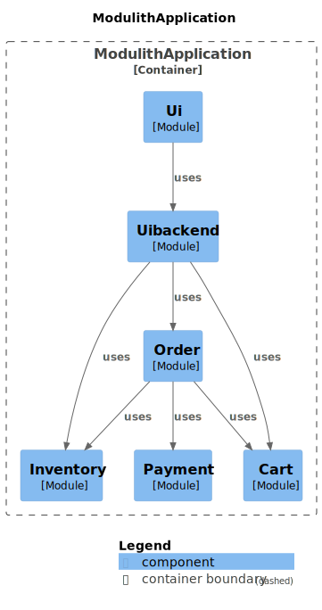

========================
T2-Modulith Architecture
========================

The T2-Modulith application consists of six modules:

The main difference between this architecture of the modulith implementation and the implementation of the :doc:`microservices architecture <../microservices/arch>` is the removal of the orchestrator service. In the monolithic implementation the finalization of an order gets coordinated by the order module.

Modules
-------

UI Module
~~~~~~~~~

The UI module provides a simple website. It is based on the UI of the original `TeaStore <https://github.com/DescartesResearch/TeaStore>`_ and implemented with JSP.
The UI module communicates with the UI backend module directly by inter-process communication.

UI Backend Module
~~~~~~~~~~~~~~~~~

The UI backend module acts as an API gateway and interacts with the cart, inventory and order module.
It provides REST endpoints, but they are not used by the UI.

Order Module
~~~~~~~~~~~~

The order module is responsible for saving orders to the database and handling the completion of orders (trigger payment, committing reservations, deleting cart).

Inventory Module
~~~~~~~~~~~~~~~~

The inventory module is the inventory of the T2-Project.
It manages the products and reservations.

The products are the teas that the store sells and reservations exist to express that a user plans to buy some units of a product.

Payment Module
~~~~~~~~~~~~~~

The payment module is responsible for contacting the payment provider.

In a more real situation, a payment service would contact different payment providers, e.g. paypal or a certain credit institute based on which payment method a user chose.
However, here the payment module knows only one payment provider and always contact that one.

The default payment provider is the fake `Credit Institute Service <https://github.com/t2-project/creditinstitute>`_.

Cart Module
~~~~~~~~~~~

The cart module manages the shopping carts of the T2-Project.
The content of a user's shopping cart is a map of Strings to Integers.
Within the context of the T2-Project it contains which products (identified by their id) and how many units there of a users wants to buy.

Migration from Microservices
----------------------------

The following table shows how the microservices implementation was migrated to a monolithic implementation.

.. list-table::
   :header-rows: 1

   * - Microservice
     - Modulith
     - Comments
   * - `Cart <https://github.com/t2-project/cart>`_
     - Cart Module
     - 
   * - `Inventory <https://github.com/t2-project/inventory>`_
     - Inventory Module
     - 
   * - `Order <https://github.com/t2-project/order>`_
     - Order Module
     - 
   * - `Payment <https://github.com/t2-project/payment>`_
     - Payment Module
     - 
   * - `UI <https://github.com/t2-project/ui>`_
     - UI Module
     - JSP 😕 → application has to be packaged as a ``war`` package (see :doc:`Implementation <../develop/impl>`)
   * - `UI Backend <https://github.com/t2-project/uibackend>`_
     - UI Backend Module
     - | Still an API gateway for the UI but in a different way:
       | UI interacts with UI Backend via inter-process communication instead of HTTP requests over the network
   * - `Orchestrator <https://github.com/t2-project/orchestrator>`_
     - ❌
     - | Saga Pattern not needed anymore
       | → Simple transaction is used to finalize an order, part of the order module

The `common <https://github.com/t2-project/common>`_ package that is used as a jar dependency by all microservices for inter-service communication is not used by the modulith. Some parts are moved to the respective domain-specific module. There is now a ``config`` package that includes the configuration that is relevant for multiple modules, however, without any class definitions required used for communication.

Modularity & Spring Modulith
----------------------------

The modularity of the application gets verified by `Spring Modulith <https://spring.io/projects/spring-modulith>`_.
In addition to that, it generates a component diagram:

